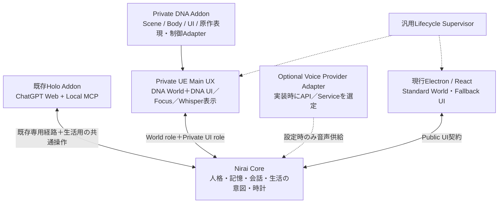

# Nirai Resident × DNA × UE4.27 — Architecture v0.5

更新日：2026-09-09。実装前の設計書。v0.4を基礎に、2026-09時点のAsset／World export手段を再確認し、FModel Aug 2026 World Exportと現行Reflectionを制作Pipelineへ反映した。Private DNA WorldのUI・Voice方針は維持する。Scene候補の策定・選定は本書の対象外で、MasterとHoloが別途行う。

**完成像は、DNA本来の空間・環境・動作を極力維持したWorldで、Holo・Grok・Codexがそれぞれ別のDNAプレイアブルBodyを持ち、Niraiの人格と判断で継続的に生活すること。Private DNA WorldではUEを唯一のMain UX Surfaceとし、DNA本来のUI／会話演出を可能な限り再利用する。現行Electron／React UIは将来の配布可能なStandard World／Fallback UIとして保持する。** CoreはUE4.27／DNA固有実装から独立させ、Private UIとWorldの内部責務も論理的に分離する。

本書のRuntime名・Protocol追加・保存形式・Phaseは設計提案であり、実装済み機能ではない。調査は既存Niraiコード、指定UEのソース／構成、DNAの非保護メタデータ、公開解析ソースと実作者報告に基づく。Editor／ゲーム起動、資産展開、バイナリ取得、保護回避、実装変更は行っていない。サブエージェント不使用。

## 1. Target Experience — 何を作るか

MasterがWorldを開くと、DNAの地形・建築・光・水・風・音の中に、3人のResidentがいる。Residentは同じ場所でIdleを繰り返すだけでなく、自分の予定と周囲の状態から、歩く、休む、景色を見る、会話する、実在する物を利用する、といった行動を選ぶ。

Masterは自由カメラで眺め、ResidentをFocusすると原作の会話演出に近いカメラへ移る。通常ResidentのPrivate UIではCurrent Niraiと同じ`会話 / 仕事`の意味切替を持ち、`会話`ならそのResidentとのWhisper、`仕事`ならそのResidentへのDirect Taskを開く。Holo Focusは既存専用Whisper Surfaceの例外を維持し、通常Resident用Direct Task assigneeへ変換しない。他のResidentは生活を続ける。Focusを解除すれば、元の自由カメラへ戻る。「座って」「ここへ来て」のような会話上の依頼と、実作業を開始するDirect Taskを文面だけで混同しない。

終了後に再起動すると、Nirai Worldの時刻が進み、Residentは前回状態と予定から無理なく続く現在状態にいる。終了中の全物理計算は不要だが、長時間停止したポーズをそのまま再生して世界の停止を感じさせることは避ける。

原作空間を暮らしに合わせて改装しない。ベッドがなければ増設せず、そのSceneに実在し、利用可能と確認できた椅子や場所の中で暮らし方を考える。ここでいう **Affordanceは「その場所や物で実際にできること」**。見た目が椅子でも、姿勢・出入り・占有・原作挙動を検証するまで「座れる」とBrainへ伝えない。

## 2. Requirements — 固定する完成条件

| ID | 確定要件 | 設計上の扱い |
|---|---|---|
| R1 | DNAのWorld表現と生活利用可能な原作挙動を最大限残す | 原実装再利用→資産・設定を保持した最小再実装の順で判断。再現差を台帳化 |
| R2 | 身体はDNAプレイアブルキャラクター | 人格・記憶はNirai。現在のVRMを完成Bodyの代用にしない |
| R3 | 初期Holo・Grok・Codexの3人が同時生活 | 固定3枠のコードにせずResident一覧から生成。Gemini・Serina等を追加可能 |
| R4 | ResidentとBodyは同時点で1対1、Masterが変更可能 | 排他的なBody割当と安全な交換処理。キャラクターの具体割当は未決定 |
| R5 | 原作Animation／Expressionを行動と接続 | 歩行・会話・Focus・Interactionに応じた遷移、視線・口形・姿勢の競合を管理 |
| R6 | Voiceは特定Engineへ依存しない | 実装時にVoice API／Serviceを選定できるProvider境界だけ保持。設定なしの場合だけ審査済みDNA短音声。停止・故障を「設定なし」にしない |
| R7 | 自由カメラ→Focus会話カメラ→Whisper→自由カメラ | Holo専用Whisperと通常Residentの既存公開範囲を維持 |
| R8 | Brainが選択しWorldが実行、結果がBrain／Memoryへ戻る | 自律生活Coordinator、観測・行動・結果の契約を新設 |
| R9 | カメラ外でも生活が継続 | 初期3人の移動・Interactionは常時計算。描画を先に軽量化 |
| R10 | Nirai時刻で環境を駆動し、終了中も自然な継続を表現 | Coreの時計＋上限付きの不在期間処理。未観測の出来事を実体験として捏造しない |
| R11 | Active Sceneは常に1つ | Scene Packを将来切替可能。Identityは共通、物の状態はScene別に保存 |
| R12 | CoreはUE4.27／DNAに依存しない | 共通IDと意味情報だけを通信し、Actor・BP・DNAパスを渡さない |
| R13 | DNA資産・派生資料はPrivate | 制作、実行、保存、検証、成果物まで物理的に分離 |
| R14 | 保護・アクセス制御の回避は実行しない | 入力工程のBlockerとして扱う。公開資料調査は継続可能 |
| R15 | 最初の完成は統合Vertical Slice | 12章の全項目を同じSceneで満たす。単体PoCを完成扱いしない |
| R16 | Private DNA WorldはUEだけを通常利用時のMain UX Surfaceにする | DNA原UIをReuse→Adapt→Reconstructの順で優先。Electron／React UIは配布可能Standard World／Fallback用として保持し、Private常用時に別Window操作を要求しない |
| R17 | 通常Resident Focus中もCurrent Niraiの`会話 / 仕事`意味境界を維持する | `会話`はWhisper、`仕事`はFocused ResidentへのDirect Task。文字列heuristicだけで通常会話をTaskへ昇格せず、`仕事`modeでは`@名前`をWhisper宛先として再解釈しない。Holo Focusは専用Whisper Surfaceの例外を維持する |

人物NPCの人格、Quest、シナリオ進行、戦闘システムの復活は対象外。ただし日常表現に必要な原作クラス依存は調査し、戦闘Animationも技術上必要な参照として保持することまで禁止しない。Resident同士の自発会話は初期Architectureへ含めるが、その全面実装は最初のVertical Slice後でよい。

## 3. Runtime Architecture — 接続と責務

### 3.1 現行コードから分かった境界

2026-09-09のCurrent作業ツリーを再読した。前版からコードが更新されても根拠が腐らないよう、以下は固定行番号ではなくCurrentのsymbol／message contract／component名で参照する。既存の未commit変更は本設計根拠の確認対象として読むが、ここで別の実装変更を行ったことを意味しない。

| 現状の根拠 | 設計への影響 |
|---|---|
| [core/server.py](../core/server.py)：World hello登録経路の`role == "world"`、`_world_connection`、`_send_hello_ack()`。新World登録時は旧Worldを置換する | 現行仕様のままElectronとUEを2つのWorldとして接続できない |
| [core/server.py](../core/server.py)：`_broadcast_agent_event()`、`_try_world_send()`、`task_update`／`chat_append`等のWorld送信経路 | UIと物理Worldを分けるには、接続数だけでなく通知先の分類が必要 |
| [core/server.py](../core/server.py)：`_request_world_action()`。`action`はResident名／command／argsを送り、既定60秒で`action_done`を待つ | 継続行動、進捗、取消、不明結果の照合は拡張が必要 |
| [core/protocol.py](../core/protocol.py)：`PROTOCOL_VERSION = 1`、`CORE_CAPABILITIES`、`runtime_descriptor()` | 新接続契約は版を上げ、既存Worldには互換Adapterを置く |
| [core/world_runtime.py](../core/world_runtime.py)：`WorldRuntimeLauncher` / `WorldRuntimeProcess`の汎用Launcher境界 | UEライブラリをCoreへ入れず、起動設定と監督処理を整理できる |
| [core/__main__.py](../core/__main__.py)：`_run()`が`server.bound_port`をLauncherへ渡し、World正常終了／連続障害時のCore終了方針も所有 | 固定ポート問題は現行には置かない。WorldとCoreの終了方針は変更が必要 |
| [App.tsx](../world/src/renderer/src/App.tsx)：`enqueueResidentSpeech()`、World message handler、Focus state、`ChatBar` / `HoloWhisperSurface`接続 | 音声、action、3D Focus、会話UIが同居。表示先を抽象化して既存UIを残す |
| [ResidentService](../core/residents/service.py)：`ResidentDefinition` / `ResidentTtsSettings` / `ResidentService.load()` | Resident名が現行ID相当、`tts`の既定値で設定の「不在」が失われる。安定IDとVoice状態の移行設計が必要 |
| core／world実行コードのworld_observation検索、tick_interval_min／tick_budget参照検索 | 生活観測・定期的な自律意思決定が既に実装済みとは確認できない。設定項目があるだけでは生活Runtimeと数えない |

### 3.2 接続方式と表示面の比較

内部の責務分離と、Masterが見るUI Surfaceを分けて考える。Private DNA WorldではUEを唯一のMain UX Surfaceとするが、UI権限とWorld実行権を同一責務へ潰す必要はない。

A＝Core→Electron World Host→UE。B＝UEをWorldとして直結し、Electron UIを別表示で残す。C＝Coreの役割別接続・送信先・起動責務を整理し、Private UEがWorldとPrivate UIの論理役割を担う。現行Electron UIはStandard World用として別系統に保持。D＝Private／Publicを問わずUIを全面UE化しElectron UIを廃止。

| 比較軸 | A：World Host | B：UE＋別Electron UI | C：役割分離＋Private UE Main UX【採用】 | D：全面UE化 |
|---|---|---|---|---|
| Private UX | 中継構成に依存 | 別Window往復となり要件不適合 | UE画面内でDNA UI／会話演出を統合 | 統合可能 |
| Core変更量 | 小〜中。終了方針・観測等は必要 | 中。既存暗黙送信先が残りやすい | 中〜大。UI／World送信先と権限を明示分離 | 中〜大。さらにPublic UI移植も必要 |
| Protocol汎用性 | Host内の独自振分けが増える | UI拡張が場当たり化しやすい | UI／World／Voice Providerの契約が明確 | UE都合がPublic契約へ入りやすい |
| 現行Electron UI | Hostとして大改修 | Private常用に残る | 配布可能Standard World／Fallbackとして維持 | 廃止となり将来配布資産を失う |
| UE crash分離 | UIは残るがHost障害も影響 | Electron UIは残る | Coreは継続。Private UIはWorldと共に落ちるがStandard UIは独立資産として残る | Core以外の可視UIを失う |
| 起動・再接続 | Core↔Host↔UEの2段照合 | 直接だが通知先修正漏れに注意 | 一つのWorld lease＋論理UI sessionを役割別再同期 | 単純だがPublic経路もUEへ依存 |
| 将来のWorld実装 | Host経路が共通依存 | 分岐が積み重なる | UE／Three.js／将来Worldを共通契約で交換 | 全WorldへUE UI思想が波及 |
| Private DNA隔離 | 可能 | 可能 | DNA UIをPrivate Addon内に閉じ、Public UIへ逆流させない | 可能だがPublic／Private境界が薄くなる |
| 保守性 | 中継層を恒久維持 | 二重Surfaceを常用 | PrivateとPublicの用途分離が明確 | UI全面再実装の負担が大きい |

**Cを採用する。** Private DNA WorldではUE Windowだけを通常利用時のMain UX Surfaceとし、DNA原UIのReuseを最優先にする。一方でCore内部ではUI操作とWorld物理結果の権限を分離し、同じUEプロセスから来たメッセージでもrole／session／message typeで検証する。現行Electron／React UIは削除せず、配布可能なStandard World／Fallback UIとして保持する。Private常用時にElectronの別Window操作を要求しない。

DNAクライアント内への注入、原作サービスごとの復活、全Sceneの手作り、Cook済みPak丸ごと読込みは基本方式にしない。利用条件を満たす編集プロジェクト／互換資産が得られる場合は直接再利用を最初に評価し、不足する単位だけ再構築する。

### 3.3 採用構成



Private DNA Worldの通常利用時にMasterが操作する可視SurfaceはUE Windowだけとする。Focus、Whisper、Resident選択、Body／Scene設定などPrivate常用操作は、可能な限りDNA原UIを再利用したUE内UIから行う。現行Electron／React Windowを同時に開いて行き来することを完成形にしない。

同一UEプロセスがPrivate UIとWorldを提供しても、Core側の権限は分ける。Private UI roleはMaster会話、Focus、設定、Body変更、Scene切替要求を送れるが、物理完了結果を生成できない。World roleは観測・action結果・Camera実状態を返すが、Master設定を変更できない。実装は別Socketでも一接続内の役割付きChannelでもよいが、権限境界と再接続世代を曖昧にしない。

現行Electron／React UIと現行Three.js海中Worldは削除しない。配布可能なStandard World／Fallback UI、Core／World ProtocolのRegression確認用実装、M0〜M2 Evidenceとして凍結・保持する。Private DNA Addonが無い環境でも既存Standard WorldとUI経路が成立することを回帰条件にする。Private UIからDNA Asset名や内部パスをCoreの一般ログ／Public UIへ逆流させない。

Voiceは常設Serviceを前提にしない。特定のVoice Engine／APIを本Architectureへ固定せず、実装時に選ぶOptional Provider AdapterをCore側の汎用境界へ接続する。Provider未設定でもText Conversationは成立し、Private UEは設定済みProviderから渡された発話だけを再生・LipSync同期する。

起動監督はEngine非依存のLauncherインターフェースで行い、UE実行パス／引数／Privateパッケージの所在はローカル起動設定に置く。Coreは有効ポートと役割別短命認証を発行する。UE停止はWorld unavailableへ遷移させ、Core自体は継続する。Private UIもUEと共に失われるため、再起動・障害状態はOS側の起動導線またはStandard/Fallback UIから復旧できるようにする。アプリ全体終了は別の明示操作とする。

### 3.4 UEモジュール境界

Generic Nirai UE Runtimeは「UE専用だがDNA非依存」のPlugin。Core独立とUE Plugin非依存は別概念である。型付き通信Schema／意味的な行動定義はEngine非依存とし、UE DLLをCoreへ読み込まない。

| 提案モジュール | 責務／所有する状態 | DNA固有層から受け取るもの |
|---|---|---|
| NiraiProtocolAdapter | WebSocket、検証、ID変換、capability、再接続。受信後Game Threadへ反映 | 元Assetパスを外へ出さない変換口 |
| NiraiResidentRuntime | Residentごとの身体実行状態、行動キュー、知覚、AIController／CharacterMovement | Bodyが実行可能な動作と体格 |
| NiraiBodyBinding | Bodyの排他割当、交換トランザクション、binding revision | Body Profile、ロード・検証関数 |
| NiraiAnimationExpression | locomotion、Montage、表情、視線、口形、割込みと復帰 | 元Clip／Curve／Skeletonと意味対応表 |
| NiraiInteraction | 対象検索、予約、接近、実行、取消、占有・結果 | 原InteractionへのAdapter、姿勢・曲線・条件 |
| NiraiEnvironment | Nirai時刻の受取り、時間補間、意味ある環境変化の通知 | DNAの光・空・水・風・音・生物Driver |
| NiraiSceneRuntime | Active Scene1つ、Sublevel、ID解決、Nav readiness、Scene切替 | Scene Packと既存地点への意味注釈 |
| NiraiCameraFocus | 自由カメラ、Focus遷移、遮蔽回避、対象変更、元カメラ復帰 | 原作会話Camera Profile、身体別framing |
| NiraiPrivateUI | Private UE内のFocus／Whisper／Direct Task／`会話・仕事`切替／Resident・Body・Scene操作。UI権限をWorld結果生成と分離 | DNA Widget／HUD／Texture／Layout／AnimationとUI Adapter |
| NiraiVoicePlayback | **Public World presentation対象**の発話許可、再生先、開始／停止、音声時計、口形イベント。Private Whisperからは呼ばない。Provider未設定でもText会話を妨げない | 許可済みDNA短音声、または将来選定するVoice Providerの出力 |
| NiraiWorldPersistence | snapshot、journal、結果再送、復旧、世代検証 | Scene／Body専用状態の版付きserializer |
| NiraiImportEditor | 中間データの検証と編集可能Asset／Level生成。Editorのみ | DNA Import adapter。製品Runtimeには工具を含めない |
| DNA Private Addon | 原資産、Material群、Scene／Body Profile、元実装または最小補完 | 汎用Pluginを参照する側。Coreを参照元にしない |

接続・Bodyカタログ・世界全体の保存管理はGameInstance寿命、Sceneの物・占有・環境はWorld寿命、身体表現はActor／Component寿命に分ける。Map交換で生ポインタを持ち越さず、安定IDから再解決する。Public汎用PluginはPrivate Addonがなくてもテスト用の独自資産でビルドできる。

## 4. Resident Architecture — 人格と身体、生活実行

### 4.1 IdentityとBrain

Coreはresident_idを安定IDとして発行し、表示名・Brain provider・記憶・会話と結び付ける。既存の名前を使う保存／Protocolにはalias移行表を置き、既存履歴を一度に改名・移動しない。身体やSceneが変わってもresident_idは変えない。3人固定のenumや個別BPは作らない。

新設するLife Coordinatorは「観測された事実＋予定＋現在の意図＋利用可能な行動」を、そのResidentの意思決定経路へ渡す。Brainは何をしたいかを返し、Worldは経路や姿勢など身体の実行方法を決める。

- 起動／復帰、行動完了・失敗、重要な環境変化、話しかけられた時、予定時刻を判断の契機にする。毎Frame／歩行の一歩ごとにBrainを呼ばない。
- Resident単位の判断を直列化し、発話・生活判断・割込みが同時に矛盾した意図を確定しない。イベントをまとめ、優先度と予算を設ける。
- Brainが作った一定期間の生活予定は、Worldの実行器が継続する。予算切れ・provider停止時は有効な既存予定を実行し、使えない物を勝手に置き換えた新しい意思決定を偽装しない。
- 周囲の物・他Resident・環境を知覚範囲付きで渡す。World全体の診断snapshotを全Residentの知識へ流さない。
- 外部Brain利用の回数／費用／上限は既存のMaster設定に従う。初期3人の負荷はGPUだけでなく判断回数・遅延も測る。

**Holoは通常Brain Driverに変換しない。** 現行はholo-addonとChatGPT Web／Local MCPの専用経路であり、Coreが通常APIのように自由に起動できる頭脳ではない。既存Local MCPへ、公開範囲を守る生活観測取得・意図提出・行動結果待機の共通機能を追加する設計とする。Holo自身が活動中に出した生活予定を保存し、待機中もWorldが実行できるようにする。

ただし「いつでもCoreが休眠中のHoloに新しい推論を開始させる」機能は現行確認できない。Vertical SliceではHoloが実際の専用経路から生活意図を提出し、Worldが実行・結果返却するところを必須にする。無人長期常用での再判断は、承認済みの起床経路またはHolo作成の有効期限付き予定の継続範囲を検証する。未解決なら常用化のBlockerとして残し、別Brainの判断をHoloと呼ばない。[既存Holo設計](./詳細設計/12_HoloAddonとChatGPTDive.md)

### 4.2 Body Profileと交換

Private Body Profileはbody_id、同一キャラクターを表すexclusive_character_id、版、Mesh／Skeleton／髪・衣装・物理、体格、Animation／Expression、音声、Camera framing、Interaction適合条件を持つ。衣装違いのProfileでも同じキャラクターを2人で同時使用しない。初期割当はMasterの選択を受け、3人とも別Bodyで起動検証する。

BodyBindingの正本はWorldのScene非依存レジストリ。UIからの変更要求をCoreでMaster操作として検証し、Worldへopaqueなbody_idとrequest_idで送る。DNA名称・プレビュー・実Asset参照を持つカタログはPrivate UIデータとしてローカル取得し、Brain文脈やCoreの一般ログに混ぜない。

**交換方式は、安全な姿勢まで移行した後の短いTransitionで確定する。** 即時Mesh差替は、着座中の体格変更、音声残留、衣装ロード失敗を起こしやすい。

1. 現在のbinding revisionを照合し、新Bodyを予約。別Residentが使用中なら競合として返す。2人の入替は一括交換要求で両方を予約する。
2. 裏で新Bodyと必要資産をロードし、Skeleton・日常動作・現在Sceneの通行条件を検証。失敗なら元Bodyを維持する。
3. 進行中のInteractionを安全な境界まで進め、着座なら起立、昇降機なら停止階まで待つ。取り消せない途中状態で交換しない。要求自体はいつでも受理し、待ち理由をUIへ返す。
4. 同じ位置で新体格が成立すれば短いfadeで差替。成立しなければ既存の歩ける地点への移動後に交換する。緊急復帰は明示Transition中に検証済み既存地点へ再配置する。
5. 旧Voice／Montageを停止し、binding世代を更新して全割当を一括確定。旧Bodyの占有権を解放し、Focusを新Bodyへ再接続する。
6. 途中crash時は保存済みtransactionを照合し、未確定なら旧割当へ戻す。二重Bodyや未確定の解放を残さない。

人格・記憶・会話は保持し、古い身体にだけ成立した「椅子に座り続ける」等の身体状態は再検証する。通常のカメラ外生活に、この交換用再配置を流用しない。

### 4.3 行動とAnimationの状態

```text
意図の受理 → 対象の確認／予約 → 接近 → 姿勢合わせ → 動作開始
          → 安定した結果の確認 → 完了通知 → 継続状態（例：休憩）
各段階 → 取消／失敗 → 安全な姿勢へ戻す → 予約解放 → 結果通知
```

「座る」の完了は実際に座位へ入った時。「休憩し続ける」はその後の状態で、60秒を超えてaction応答を待たせる設計にしない。経路失敗、途中で扉が閉じる、別Residentが先に使う場合はWorldが理由を返し、Brainが次を判断する。

Animationは基礎移動、全身Interaction、上半身ジェスチャー、顔、視線、口形の層に分ける。元AnimBPと依存が成立する場合は意味状態を渡すAdapterで使う。不足する場合に限り、原Clip・Curve・遷移条件を保持したUE AnimBPを作る。

- 移動は基本CharacterMovementを正本とし、必要な原作Root Motionを使う動作だけ移動権を切替える。位置更新を二重適用しない。
- 全身Interaction中は安全条件を優先し、会話の身振りを抑制。会話顔・視線は身体の許容範囲で重ねる。Focusだけで強制起立や移動中断をしない。
- 口形は音声の実再生時計に同期し、表情と同じMorph／骨を使う場合はmaskと優先度を定義。視線は眼・首・胴体の角度制限をBody Profileに持つ。
- 開始・ループ・終了Clip、曲線、Notify、socket、Morphの対応をBody別に検証。瞬き等はローカル表現で、Brainの意図や行動完了に偽装しない。
- 髪・衣装・揺れ物・顔材質もBody品質に含める。元実装のPhysX／cloth／独自Plugin依存を分け、標準4.27での保持可否を確認する。

### 4.4 Interactionは原作の物を使う

共通口はcan_use／reserve／begin／cancel／observe。Coreはobject_idとverbを指定し、Private Adapterが原実装を呼ぶ。予約と実際の占有はWorldが原子的に管理し、3人同時要求でも定員を超えない。予約には期限、実占有には退出確認を持たせ、通信断だけで着座者を空席扱いしない。

元の起動条件がQuest依存なら、元々の状態・見た目・動作を調査して生活Worldで自然な状態を定義する。根拠なく全扉を開放したり、装飾家具へ任意のInteractionを生やしたりしない。意味注釈は原作配置と別データで保持するが、家具の増設層にはしない。

### 4.5 Voice方針

VOICEVOXは本Architectureの依存から外す。VOICEVOX Engineの常時起動、Electron mainによるVOICEVOX合成、VOICEVOX前提の設定SchemaをPrivate DNA Worldの基盤にしない。実際の音声実装へ着手する時点で、利用可能なVoice API／Serviceを別途選定する。

| 設定状態 | 再生経路 |
|---|---|
| Voice Providerが設定済み・有効 | そのProviderだけを使用。DNAの台詞・相槌・Idle voiceを抑制 |
| 設定済みだが無効／mute／合成失敗／provider停止 | 無音またはPrivate UIへ状態表示。DNAへfallbackしない |
| Voice Provider設定が明確に不在 | 審査済みDNA短音声のみ利用可能。会話本文はテキストで成立 |
| 旧設定の有無が判定不能 | unresolvedとしてDNA音声を止め、設定移行で解決 |

Voice設定には少なくともpresence＝absent／present／unresolved、provider_id、provider固有設定へのopaque参照、voice_revisionを持てる汎用境界を用意する。旧TTS設定からの移行規則は実装時に現行Schemaを再確認して定め、旧VOICEVOX形式を新Architectureの正本へ昇格させない。

Core／Conversation／Resident／UEは特定Voice Engineを知らない。CurrentのVoice Provider／NiraiVoicePlayback経路へ渡すのは**Public World presentation対象**の発話だけとし、Coreはその発話本文、speaker、speech_id等の意味情報をProvider Adapterへ渡す。生成音声はWorld roleへ用途限定の手段で受け渡すが、Private Whisper本文・発話状態・音声再生指示はこの経路へ入れずWorld roleへ送らない。将来Private Whisper専用音声を導入する場合は、Public presentationを再利用せず権限付きPrivate UI向けの非World経路を別契約として先に設計する。具体的なAPI、認証、課金、Streaming方式、音声形式はProvider選定時に確定する。Provider未設定でも会話・字幕・生活判断は停止しない。

DNA短音声はclipごとに意味・言語・文脈・人格への影響・再生間隔・公開範囲をPrivate台帳で判定する。相槌、笑い、呼吸、感嘆、汎用短発話、自然な独り言を候補とし、Quest／Story／固有人格の台詞は登録しない。Voice Clone／任意文のDNA声TTSは作らない。

AnimNotifyだけでなく元AnimInstanceやAudioManagerからの直接再生も共通Voice Policyへ通す。原作のIdle→音声呼出しは公開Luaで確認できるため、Providerを設定したResidentではDNA発話が別経路から漏れないようにする。足音・服音・環境音は発話と分けて保持する。speech_idとbinding revisionで重複再生・Body交換後の古い声を防ぐ。LipSyncは実際の再生時計へ同期し、Provider固有のタイムスタンプが無くても最低限の振幅／音素解析へ差し替え可能な境界にする。

## 5. Scene / World State — 一つの世界を継続させる

### 5.1 Scene Packの契約

Sceneの具体名・候補・優先順位は決めない。MasterとHoloから後で渡されるSceneに対し、以下の同じ契約を適用する。

Scene Packはscene_id、pack revision、対応Runtime／保存schema、入力manifest、背景Level群、Environment Profile、既存地点の意味注釈、Interaction一覧、Body適合条件、Camera Profile、復帰可能地点、状態移行規則を持つ。復帰地点は原作の歩ける床上にある論理的な目印であり、新しい家具・建築ではない。

UE4.27ではPersistent Level＋Sublevel Streamingを使い、一つのScene内にあるArt／Design／室内外区画を必要に応じて読み込む。Active Scene1つは「Sublevelも1枚だけ」という意味ではない。UE5のWorld Partition／Lumen／Naniteを前提にしない。[Epic 4.27 Level Streaming](https://dev.epicgames.com/documentation/en-us/unreal-engine/level-streaming-overview?application_version=4.27)

Scene Runtimeの状態はUnloaded→Loading→Reconciling→Ready→Quiescing→Saving→Unloaded。World通信接続、描画表示、Nav／Collision、Body3体、Interaction、環境Driverの準備を分け、必要項目が成立するまでReadyを返さない。

### 5.2 状態の正本

| 状態 | 正本 | Scene変更・再起動時 |
|---|---|---|
| Resident Identity、人格、Memory、Conversation | Core／既存Holo専用経路 | 維持。BodyやSceneに移さない |
| 生活意図、予定、有効期限、判断待ち | Core Life Coordinator | 新Sceneの実在能力で再検証 |
| Nirai World時刻、時刻倍率、Scene選択条件 | Core World Clock／Scene Policy | Scene固有時計を正本にしない |
| Body割当と交換transaction | Worldの共通Binding Store | Sceneをまたいで維持 |
| Residentの位置・向き・姿勢・経路・占有 | Active World | 生ポインタではなくIDで保存。経路は復帰時に再計算 |
| 扉・昇降機・利用状態・環境位相 | Scene別World Store | scene_id＋pack revisionごとに保持 |
| Focus、自由カメラ、UI編集中状態 | UI／Camera Runtime | 原則一時状態。起動時は自由カメラから開始 |
| 行動結果・未確認イベント | World journal、Core受領記録 | event_idで照合してMemoryへ必要分を反映 |

非Active Sceneの「前回その場所にいたResident」は現在の在席者ではない。訪問履歴として保存し、占有は退出時に解放する。再訪時は前回の地点を候補にできるが、Residentの現在の意図・時刻・物の状態を優先する。

### 5.3 Scene切替

将来の曜日・時間・Master設定等の条件判定はCoreの汎用Scene Policyがscene_idを選ぶ。中身のMap名やDNAクラスは知らない。複数Packは事前Cook済みPrivate Worldへ含め、初期からDLCの動的mount基盤を必須にしない。

1. 次Packの存在・版・必要Body適合をメタデータで事前検証する。現Scene稼働中に次SceneのActorや物理を起動しない。
2. 新規生活actionを止め、会話の安全な区切りを待つ。移動床・着座を安全終了し、FocusをTransitionへ移す。失敗時は理由を通知して延期する。
3. 現Sceneをcheckpointし、退出と未完了actionを記録。現Sceneを非Active化し、World lease内のscene_epochを更新する。
4. 次Sceneをロードし、保存状態と現在のNirai時刻を照合。Residentの予定をそのSceneのAffordanceへ照合する。
5. 全員を原作空間内の有効地点へ配置し、Environment／Nav／Body／Interactionが成立してからReadyにする。古いSceneへのactionはscene_changedとして拒否する。
6. 失敗なら前Sceneのcheckpointへ戻す。両方失敗ならUIとCoreを残してWorld unavailableとする。別Sceneにいたかのような完了結果は出さない。

切替中はActive Sceneが0の遷移状態を許し、2つが同時Activeにはならない。外見上のワープはScene切替の明示Transitionに限定する。Coreは切替結果を受けて生活予定を更新する。

### 5.4 Off-screen Simulation

初期3人では全員の移動、Collision、経路進捗、扉・椅子の占有、行動時計を動かす。Focus対象だけを動かす構成にしない。最初からSemantic Simulationで負荷を隠さず、実機測定後に必要範囲を広げる。

| モード | 続けるもの | 軽量化するもの／制約 |
|---|---|---|
| Full | 移動、物理、Interaction、Animation、表情、近距離音声 | Focus対象、可視Resident、相互作用中を優先 |
| Reduced | 実位置での移動・衝突・経路・占有・行動結果 | 顔・髪・遠距離Animation評価頻度を下げる。画面外でも行動完了時計を止めない |
| Semantic／Background | 場所間の予定、移動距離・経過時間、予約整合 | 将来用。不可視・非可聴・他のFull主体と非接触の閉じた区画だけ。移動床等は原則対象外 |

可視性だけでなく、他Residentから見える／聞こえる、使用中の物、影・反射、カメラの移動方向も昇格条件にする。境界には距離差と最低滞在時間を持たせ、毎Frameの行き来を避ける。Focusは対象を事前にFullへ昇格させ、姿勢の評価を済ませてからカメラを寄せる。

Semanticからの復帰は保存した経路と時刻から到達可能な位置を算出し、実Nav・占有と照合して不可視のうちにActorを用意する。見えてから瞬間移動で合わせない。自由カメラが急移動して準備時間を確保できない場合、その区画のSemantic化を禁止する。**この条件を保証できない間はReducedまでで運用する。**

UE4.27ソースにはEVisibilityBasedAnimTickOptionがあるが、OnlyTickPoseWhenRenderedの一括指定でGameplayまで止めない。行動の正本をAnimNotifyだけに置かず、Root Motionや骨更新が必要な対象は適切にtickを維持する。これはEngine側の選択肢の確認であり、本Worldで負荷削減が実証済みという意味ではない。

## 6. Camera / Conversation — 観察と私的会話

### 6.1 Focusの状態遷移

```text
Free → FocusRequested → CameraBlending → FocusedWhisper
     → ReleaseRequested → CameraReturning → Free
```

Private UEでResidentをクリックすると、Private UI roleがfocus_requestをCoreへ送り、対象の会話経路と権限を確定する。Coreは同じfocus_id／世代でWorld roleへfocus_setを返し、Cameraを遷移させる。Private UI内のResident一覧からの選択も同じ経路を使い、異なる二つのFocus正本を作らない。World roleは遷移進捗だけを返す。素早い対象変更では古いカメラcallbackを無視する。

自由カメラの位置・向き・FOVを入口で保存し、原作Camera Profileの位置、焦点距離、注視点、補間曲線を用いる。Masterは身体を持つプレイヤーではないため、元のPlayer／TalkPawn操作依存をCamera Adapterで取り除き、Residentを話し相手として構図を作る。身体サイズ、着座姿勢、背後の壁に応じてcamera collisionとframingを調整する。

公開TalkCameraManagerにはCameraBlend、curve別FOV／位置／回転、焦点距離、CameraBreathe等がある。一方、UTalkFunctionLibrary、USequenceFunctionLibrary、TalkContext、PlayerControllerなどに依存する。したがって「原作会話カメラの存在と制御入口」は確認済みだが、原作プリセット一式と独立実行は未確認。原Profile／曲線／Sequenceの再利用を優先し、欠ける制御だけUE Camera Manager／CineCameraで補う（13章E13）。

Focus解除は会話の私的な公開範囲を変えない。未送信文・進行中応答の扱いは既存Conversation規則を保持し、カメラを戻したことで応答を公開Sayへ変換しない。Scene切替／Body交換／対象消失は世代付きでFocusを終了または再接続する。

### 6.2 Whisperの既存意味論を維持する

| 対象 | 現行正本と新Worldでの経路 |
|---|---|
| 通常Resident（Grok／Codex等） | 既存master_whisperとPrivate Memoryを利用。Private UI→Core→該当Brain。非参加Residentへ本文・履歴を渡さない |
| Holo | 既存holo-addon／ChatGPT Conversationの専用経路を正本として維持し、Private UE UIをHolo Whisperの表示・入力Surfaceにする。通常master_whisperへ変換せず、Core Memoryへ私的履歴を複製しない |
| 公開Say／Resident間公開会話 | Coreの公開Conversation契約を通す。実空間で聞ける範囲と会話参加者の知識を分ける |

Current根拠は、Coreの`master_whisper`処理とHolo Addon専用Conversation／Holo Local経路、Worldの`focusedResidentName` / `holoResidentFocused`、`ChatBar.onSendWhisper`、`HoloWhisperSurface`接続である。通常Residentへ送るのと同じJSONをHoloへ送ればよい、という設計にはしない。

Whisper本文をUEの**World role**へ渡さない。一方、同じUEプロセス内の**Private UI role**には、Masterが現在の会話を表示・入力するために必要な私的Conversation eventを権限付きで送ってよい。通常Residentでは既存Private Memoryの公開範囲に従い、Holoではholo-addonの専用経路から当該Surface表示に必要なイベントだけを中継し、Core Memoryへ複製しない。Private UIが閉じた後の独自な第二履歴DBは作らず、再表示時の履歴取得可否は各Conversation正本に従う。

Private Whisper固有の本文・発話中／聴取中状態・会話身振り・表情・音声再生指示を**World roleへ渡さない**。Whisperの表示と応答状態は権限付きPrivate UI roleだけで扱い、World頭上吹き出し・TTS・公開会話Animation・他Residentの知覚イベントへ派生させない。Holo私的本文をWeb画面から抽出して独自TTSへ回す経路も追加しない。将来Private Whisper専用音声を導入する場合は、Public World presentationを再利用せず、上位Privacy Contractと専用の非World経路を先に明示設計する。

FocusはMasterの視点変更であり、Residentの身体への操縦権ではない。会話参加の反応・歩行停止・着座継続等はBrainの意図と身体安全条件で決める。非対象Residentの予定・移動・環境反応は継続する。

### 6.3 Focus中の`会話 / 仕事`とDirect Task

Private DNA Worldへ移行しても、Current Standard Worldで成立している「通常ResidentをFocusした時に何を送るか」の意味契約を落とさない。通常Resident Focus中のPrivate UIは`会話 / 仕事`をMasterが明示的に切り替えられるSurfaceを持つ。DNA原UIに同等の見た目が無い場合も、Reuse可能な部材・Layout・Animationを優先してこの意味選択をAdaptし、Electron別Windowへ逃がさない。Holo Focusは既存専用Whisper Surfaceを使い、この通常Resident向け切替の対象外とする。

- `会話`：宛先指定なしの本文をFocused ResidentへのWhisperとして送る。通常Residentは既存`master_whisper` / Private Memory契約、Holoは既存Holo専用Conversation契約を維持する。
- `仕事`：本文全体をFocused **通常Resident**へのDirect Taskとして送り、Councilを必須経路にしない。Current Coreの`task_request {text, resident}`と07のDirect Task契約を意味正本とし、Private UIだけの別Task semanticsを作らない。Holo Addonを通常ResidentのDirect assigneeへ変換しない。
- 通常会話・Whisper本文の文面だけからNiraiが実作業Taskへ自動昇格してはならない。Task化はMasterが`仕事`を明示した入力、または既存の明示Task Shortcut等に限定する。
- `会話`modeの`@名前`はCurrent NiraiどおりWhisper宛先指定として利用できる。`仕事`modeではWhisper parserへ入れず、`@名前`を含む入力文字列全体をFocused ResidentへのTask本文として扱う。
- Focus解除後の素の会話入力はSayへ戻る。`仕事`modeはFocused Residentが存在する時だけ通常Direct Task導線として意味を持つ。
- TaskのApproval / Question / Plan /進捗等は既存Agent Runtime契約を正とし、DNA UIはそのMaster操作SurfaceをUE内に提示する。Private UIがAgent権限やallowed_dirs境界を拡張しない。

この切替は単なるボタンの外観ではなく、Private Whisperと実作業開始を分ける意味境界である。原作UI再現を優先しても、この境界を省略・文字列推測へ置換しない。

### 6.4 Resident同士の自発Conversation

Coreにparticipants、initiator、公開範囲、話者順、終了条件を持つConversation Sessionを置き、生活意図から「相手と話す」を要求可能にする。Worldは接近・顔向け・距離・相手の利用中状態を検証する。会話の内容や相手の参加意思をWorldが作らない。

既存resident_chatにはapproach／face／gatherがあるが、移動失敗後も会話継続する現行経路がある。新Worldでは「遠隔会話が許されるか／接近し直すか」を明示し、到着成功を捏造しない。Holo参加は既存専用Conversation経路へ接続する。最初のVertical Sliceでは自発会話の全面完成を後送できるが、Session ID・参加者・割込み・観測範囲のSchemaは初期から確保する。

## 7. DNA Reproduction Scope — 再利用する範囲と上限

再利用の判断は資産・機構ごとに行う。分類はReuse（原実装と依存が成立）、Adapt（原資産・設定を保持して接続のみ変更）、Reconstruct（不足する実行／描画部分を原作へ合わせて再構築）、Blocked／Missing。安易な全面Reconstructを初期値にしない。

| 対象 | 再利用・復元方針 | 品質の確認点 |
|---|---|---|
| 地形・建築・Static Mesh | 元形状・配置・LOD・instanceを保持。Landscape／Foliageは専用Import | UV、法線、頂点色、collision、近景LOD。HLODを歩行範囲の代用にしない |
| Texture・Material・Shader | 元グラフ・親・Instance・Texture・定数を保持。グラフ欠落時のみ系統別再構築 | 色空間、packed channel、Unicode parameter、髪・肌・水・植生・輪郭表現 |
| Lighting・Post Process | Light／Sky／Fog／露出／色補正／反射を一組で再現 | 元の時刻・FOV・露出・画質を揃え、固定時刻から昼夜へ比較 |
| VFX・水・風 | 元Particle／Curve／Material／配置・時間関係を保持 | Niagara／Cascade、独自Component、流速、揺れ、反射、昼夜との整合 |
| 環境音・音楽 | 元音源・位置・ループ・時間条件を保持。FMOD event可搬性を確認 | bankを取得できることと再生可能性は別。欠ける制御だけUE音響へ |
| 昼夜・Environment | 元環境DriverにNirai時刻を入力。元サーバー時刻依存を外す | 時刻設定入口だけで全環境を再利用できるとは扱わない。曲線・Lightmap整合 |
| プレイアブルBody | 元Mesh／Skeleton／衣装／髪／顔／物理を一組で再利用 | 3つの異なるBody、顔の近景、全身と服の破綻、常用負荷 |
| Animation／Expression／視線 | 元Clip・Morph・Curve・Notify・姿勢を生活Runtimeへ接続 | クリップ一覧だけで成功にしない。会話・移動・Interaction間の遷移 |
| UI／HUD／会話Widget | DNA原UIをReuse→素材・Layout・Animationを使ったAdapt→UMG等でReconstructの順に評価 | Focus／Whisper／`会話・仕事`切替／Direct Task／Resident・Body・Scene操作。別Electron Windowを必要としないこと、原作の見た目・遷移・入力感 |
| 扉・椅子・昇降機等 | 元機構を先に評価。独自C++／Quest依存だけ最小置換 | 見た目、速度、遅延、音、乗降、占有、割込み、復帰 |
| 鳥などの環境生物 | 原作に存在する種・配置・経路・Animation・反応を保持 | 生物の名前だけで環境用途と決めない。イベント／敵／Quest依存を分類 |
| 人物NPC・Quest・戦闘 | 復活対象外。生活機構の参照依存だけ調査 | ゲーム起動処理・サーバー・進行フラグの一式移植へ広げない |

Mesh／Texture／Animationにはツール担当者の成功報告がある。一方、Scene全体の高精細配置、編集用Materialグラフ、独自C++／BP、環境や会話の全依存が揃う証拠はまだない。**DNA→UE4.27の全体再現率を数値化できる段階ではない。** 最大の技術課題は、この欠落依存をScene・Body・Environmentのまとまりとしてどこまで補えるかである。

環境生物のActorもWorld側で動かし、Residentには視認・近接等の観測として返す。汎用の鳥モデルを新しく大量配置して原作再現を補ったことにはしない。公開BP_Bird_FeinaはDungeon進行・Spline生成に依存し、通常の背景鳥をそのまま復元できる証拠にはならなかった（13章E15）。

### 7.1 原作Interactionの具体的な救出単位

| 公開ソースで確認した機構 | 依存と再利用単位 | Worldへの接続 |
|---|---|---|
| BP_AutoDoor_C | PrologueDoor継承、Region DoorOpenState、2秒遅延閉鎖、Rep通知 | Mesh・開閉・遅延・音を保持候補。地域保存をWorld Stateへ接続 |
| BP_ElevatorInteractiveComponent_C | AElevatorMechanismBody／Character等の独自クラス、Battle Eid、距離・向き、BPでの開閉 | 台・扉・停止階・曲線を一単位で評価。乗降・移動床・占有・復帰を管理 |
| EFNode_SitOrStand | TalkContext／TalkActor、SetSitPoseInteractive等、完了callback | 元の座位・開始終了Clip・姿勢を使用。会話フローを行動の開始完了へAdapt |
| SetTimeOfDayNode | AEnvironmentManager:SetTimeOfDay、補間時間、理由指定 | Core時刻→Environment Driver。Manager本体と曲線を別途確認 |
| WorldCompositionSubSystem_C | LevelLoader、Art／Design、移動停止再開、GameMode、植生品質 | Scene readinessへ接続。原作ゲーム全体の起動順を持ち込まない |

資料への固定リンクは13章E6の下にまとめる。UnLua Pluginが導入できてもDNA独自クラスは供給されない。再利用可能なLuaのまとまりと権利条件が成立するときだけPrivate層で採用し、欠落C++を大量の空stubで誤魔化さない。[UnLua作者資料](https://github.com/Tencent/UnLua)

### 7.2 DNA UIの再利用方針

Private DNA WorldのUIもSceneやBodyと同じく原作再現対象とする。最初からNirai独自デザインのUMGを作るのではなく、対象Scene／会話導線で使われるDNAのWidget Blueprint、HUD、Texture、Font、Material、Layout、Animation、Input処理、Talk／Focus連携を調査する。

優先順位は次の通り。

1. **Reuse**：元Widgetと必要依存が独立Worldでも成立するなら、その表示・遷移・入力を保持し、Niraiの意味データへAdapter接続する。
2. **Adapt**：元Widget全体が動かなくても、Texture／Layout／Animation／Widget構造等を保持できるなら、DNA固有GameMode／Quest／Player依存だけをNirai用Controllerへ置換する。
3. **Reconstruct**：必要資産や実行依存が欠ける場合に限り、取得できた原UIを基準にUE4.27 UMG／Slate等で再構築する。既存Electron／React UIをPrivate画面へ重ねる方式はFallbackにしない。

Focus→原作会話Camera→`会話 / 仕事`選択→WhisperまたはDirect Task UIは一つの体験として検証する。表示される会話本文、参加者、公開範囲、Memory、Taskの担当・実行境界はNiraiを正本とし、DNA UIはPresentationと入力Surfaceに限定する。原作のQuest選択肢やシナリオ状態をNirai会話・Taskへ混ぜない。

Body／Scene設定など原作に同等画面がない管理UIは、DNAの共通UI部材を再利用してPrivate UMGとして追加してよい。ただしWorld内の家具やScene自体をNirai都合で改造しない原則とは分けて扱う。デバッグ／開発者向け画面は通常UXの原作再現対象外としてよい。

現時点ではDNA UI Asset一式の取得可否、Widget Blueprintの依存、Font／Material／Inputの互換性は未実証である。UIもP1のFeasibility対象に含め、取得できない場合はMissing／Blockedを明示する。

## 8. Asset / Reconstruction Pipeline — 制作と実行を分ける

### 8.1 工程と工具の選定

```text
条件を満たす入力＋版の台帳
  → DNA対応FModel / CUE4Parseで型・参照・依存を把握
  → FModel Aug 2026 World Exportで代表Levelを.usdaへ出力できるか最優先Spike
  → UE4.27 USD ImportでWorld配置を編集Projectへ取り込めるか検証
  → source_manifest + Scene IR + Body / Environment / Interaction / UI profiles
  → Reflection等でMaterial／Blueprint／Widget等の不足情報を補完できるか評価
  → 元実装・編集資産を直接再利用できるか評価
  → 必要単位のみMesh / Material / Layout / UI / 挙動を再構築
  → UE4.27.2 Private制作Project
  → Cook / Package / 実行検証
  → Generic Nirai UE Runtimeで生活Worldとして稼働
```

実行時は事前に検証したPrivate Packを使う。DNAのインストール先を毎回走査・展開するRuntimeにはしない。入力の保護・利用条件は13.1へ集約する。

| 工具 | 採用する役割 | 制約・比較対象 |
|---|---|---|
| FModel Aug 2026／DNA対応CUE4Parse | **第一候補。** GUI調査、属性・依存exportに加え、World ExportでLevel全体を`.usda`へ出力する | 2026-08-02版でSM／ISM／SK／Landscape／Light／Streaming Level等のWorld Exportが追加。USD-onlyで、socket／attachment配置には既知の不完全性がある。tool commit・game profile・mappingを固定 |
| UE4.27 USD Import | FModelの`.usda` Worldを編集Projectへ取り込む第一候補 | USD Stage／Importerの4.27互換、Material／Actor／階層／Landscape等の実復元率をP1で測る。FModel export成功だけでScene再現成功としない |
| UE Viewer | Mesh／Texture／Animationの代表サンプル比較・FModel結果のCross-check | 担当者報告あり。ただしローカル16001互換は実測が必要 |
| Blender／FBX | Mesh／Skeletonの調整、差分確認、必要な形式変換 | 全Sceneを一枚のFBXに潰さない。FBX経路はUE4.27の2018基準 |
| JsonAsAsset／Reflection | Material／Data／Animation補完に加え、親Classが存在する場合のBlueprint／Widget Blueprint partial import、Widget Animation等を評価 | **現行latest commitを第一Spike候補**とし、4.27で問題が出た場合に1.4.1の4.27.2版へfallback。Materialの編集データがstrip済みなら完全復元できない。Private入力ではCloud送信内容を確認する |
| umodel_tools | FModel World Exportで不足する静的配置の比較用Fallback | 動的spawnは別。DNA対応は未実証、公開組込みはGPL等を確認 |
| Ue4Export／UEAssetToolkitGenerator | FModel／Reflectionで不足する型の小規模batch生成Fallback | DNA対応・同梱parser版を確認してから使う |
| UEAssetToolkitのゲーム内Dump | 今回の入力取得方法には採用しない | ゲーム内Plugin実行を必要とする経路のため |

FModel Aug 2026のWorld Exportは、WorldをUSDへまとめて出せるため現時点のScene配置復元の第一候補とする。ただし公式Release自身がsocket／attachment配置の不完全性を明記しているため、原作Transform・Streaming構造・動的spawn・Interaction・UI・Materialグラフまで自動復元できるとは扱わない。World Export→UE4.27 Importの実測結果をScene IRへ記録し、不足部分だけ別経路へ回す。

Reflectionは現行READMEがlatest commit利用を推奨しており、Material等に加えてpartial Blueprint ImportやWidget系の一部を扱える。Private DNA UIのReuse／Adaptにも候補として評価する。ただし親C++ Classや構造が欠ける場合は定義が必要で、strip済みMaterial dataは復元できない。自動依存解決機能「Cloud」は接続先・送信内容を確認し、Private入力ではローカルのみ、または自動取得を無効にする。工具の導入・大容量取得・コンパイルは実装承認後の工程である。

Cook済み資産を直接使える場合も比較する。ただしEpicの4.27仕様ではread-only、参照パス保持、Blueprint／Niagara等の制約があり、任意の市販Mapを開ける保証ではない。[Cook済みContent](https://dev.epicgames.com/documentation/en-us/unreal-engine/working-with-cooked-content-in-the-editor?application_version=4.27)、[FBX Static Mesh](https://dev.epicgames.com/documentation/en-us/unreal-engine/fbx-static-mesh-pipeline?application_version=4.27)、[FBX Skeletal Mesh](https://dev.epicgames.com/documentation/unreal-engine/fbx-skeletal-mesh-pipeline?application_version=4.27)

### 8.2 Import IR — 原作情報を失わない中間形式

IRは工具出力を共通の帳票へ整える形式。本書の提案Schemaであり、既存ツールがそのまま生成する形式ではない。**形式はEngine非依存でも、DNAから得た中身はPrivate**である。生活用Protocolと区別し、元パス等をCoreへ送らない。

| レコード | 必須情報 |
|---|---|
| source_manifest | 入力ID、ゲーム世代表記、取得条件、元パス、資産hash、tool／commit、game profile、mapping版、変換状態、欠落理由 |
| Scene header | schema_version、scene_id、source_manifest_id、単位・軸・回転、区画と原点補正、依存、環境、原作比較条件 |
| 区画／接続 | Region／Level、親子・streaming関係、Transform、door等の接続。地理接続とActor配置を分離 |
| Actor／Component | 安定ID、元object path、型、親ID、local Transform、Mesh、Material override、可視性、用途 |
| Instance／地形 | ISM／HISM各Transform、Landscape height／weight、Foliage、Spline。普通のActorへ無制限展開しない |
| Mesh／Body | LOD、UV、頂点色、法線、socket、collision、Skeleton、基準姿勢、Morph／Curve／Notify、物理依存 |
| Material | 親、型付きUnicode parameter、Texture slot、色空間、switch、graph有無、系統、代替理由 |
| Environment | 光・空・Fog・露出・水・風・VFX・音・生物の配置、時刻入力、曲線、依存 |
| Interaction | 元クラス／Lua、使用条件、姿勢、時間、依存分類、再利用区分、Adapter、検証結果 |
| UI | Widget／HUD型、親子構造、Layout、Texture／Font／Material、Animation、Input、Camera／Talk依存、再利用区分、Adapter |
| Semantic annotation | 実在するplace／objectと可能動作の対応、根拠、定員、体格条件。原作物を追加しない |

利用する資産単位でhashし、全31GBを毎回hashする工程にしない。ソース差分、手作業補正、意味注釈は別に保持して再Import可能にする。

### 8.3 Editor Importの処理

1. Schema／入力版を検証し、未知型・欠落参照を診断へ記録する。
2. Texture／Mesh／Material等の依存資産を先に生成する。安定IDにより再実行で更新し、重複生成しない。
3. Actor／Componentを生成した後、親子参照・材質上書き・Transformを解決する。
4. 標準型の変換を基本に、DNA固有型は明示したAdapterへ渡す。取得したBP／Luaを無条件に実行しない。
5. 原作座標→区画座標→UE配置を行列で合成。HoudiniのP／rotを二重適用せず、単位・軸・回転・負scaleを非対称な基準物で確認する。
6. Landscape／Foliage／Spline／ChildActor／動的spawnは専用処理。未対応なら欠落範囲を記録する。
7. 3つのBodyの体格でCollision／Nav／段差・狭路を検証する。見た目だけのHLODに通行判定を委ねない。
8. 依存検査、Cook、別起動で検証する。Editorで見えたことだけで成功にしない。

仮箱や代替Materialは検証モードで明示する。原作再現の合格画像に混ぜず、欠落を隠さない。近景の幾何配置が欠ける場合は、広範囲の手配置を当然の工程にする前に必要工数を提示する。

### 8.4 Material・Lighting・Animationの復元判断

Materialは不透明建築、植生、水・透過、発光、Bodyの肌・髪・顔など、実対象に存在する系統から少数サンプルを選ぶ。元グラフと依存があれば再構築工具、Instanceと定数しかなければ対応Master Materialを系統ごとに作成、HLOD材質だけなら遠景専用とする。compiled shaderから編集グラフが当然に戻るとはしない。

独自Shading Modelが必要なら、標準Material／Customノード／Post Processで原作との差を測る。独自Engine改造が必須と判明した場合、4.27派生Engineの維持費を含む別の大規模判断として扱う。公開iniの独自CVarを一括コピーしない。

Lightmapは画像だけでは不足し、Mesh／UV／割当／係数が必要。揃わない場合は再ベイクと動的照明を比較する。昼夜を通すときは昼の固定間接光が夜に残る問題も検証する。露出や色補正を動かしてMaterialの差を隠す評価を避け、条件を固定する。

Bodyは可能なら各原Skeletonを維持してClipをそのまま使う。共有Clipが必要な場合のみUE4.27のRetarget Managerを評価し、UE5 IK Retargeterを計画へ混ぜない。身長差、座位、顔骨・Morph、髪・衣装は別に適合確認する。[Epic Animation Retargeting](https://dev.epicgames.com/documentation/en-us/unreal-engine/animation-retargeting?application_version=4.27)

## 9. Protocol — CoreとWorldの約束

### 9.1 版と権限

提案はProtocol v2。既存v1のtype／ts／payload／idという封筒の形は保持するが、役割認証・権限・状態照合の意味が変わるため、capabilityを足すだけで無改修互換とは呼ばない。初期移行ではv1の標準WorldをLegacy Combined Adapterで扱うモードを残し、v2 Worldと同じ実行権を同時に与えない。

helloでrole、runtime_id、version、capabilities、起動ごとのcredentialを検証する。Public UI、Private UI、World、既存holo_localを別権限として扱い、同一UEプロセス内のPrivate UI／Worldもroleの自己申告だけで昇格させない。Voice Providerを独立Serviceとして実装する場合だけ専用資格を追加する。World capabilityは実装済みverbとBody／Sceneの準備に応じて通知し、未実装のsit等を宣言しない。

Worldの交代はLauncherが許可した起動世代だけに認め、後から接続したという理由だけで現Worldを置き換えない。旧leaseのaction・結果は現Sceneへ適用せず、過去結果の照合経路で処理する。これにより再接続と二重起動を区別する。

| 送り手 | 許可する主な責務 | 許可しないもの |
|---|---|---|
| Public／Private UI | Master会話、Direct Task、Focus、設定、Body変更・Scene切替要求。Private UIはDNA Presentationを担当 | Worldの物理完了結果を偽装、Private DNA情報をPublic UIへ漏洩 |
| World | 状態観測、action結果、Camera状態、発話再生状態 | Master権限の設定変更、他Residentの私的履歴取得 |
| Optional Voice Provider | 設定された場合の合成結果・再生用音声情報 | World意図決定、私的履歴の一括取得、未設定時の必須依存化 |
| Core | 認可済み意図・発話・時計・Scene方針の送信 | UE Actor／BP／DNA Asset指定 |
| Holo専用経路 | 既存権限＋Holo自身の生活意図と許可された観測 | 通常Brain偽装、他ResidentのPrivate Memory取得 |

### 9.2 メッセージの具体案

以下の名前・追加fieldは未実装。古いaction呼出しを移植する際は接続オブジェクトを直接渡さず、World Gatewayにresident_idと意図を渡す形へ変える。Master会話とDirect Taskの意味契約は既存01／05／07を継承し、Protocol v2化を理由にWhisper-onlyへ戻したり、Private UI独自のTask判定を新設したりしない。

| 契約 | 主要field | 規則 |
|---|---|---|
| hello／hello_ack | version, role, runtime_id, capabilities, connection_id | 登録後に役割別snapshot。UI再接続でWorldを置換しない |
| world_ready | world_instance_id, world_lease, scene_id, scene_epoch, pack_revision, body_revisions, capabilities | scene_ready条件を満たした時のみ行動受付 |
| scene_description | scene_id, semantic_revision, places, objects, affordances | 原作パスを含まない。object／verbごとの体格・占有条件を示す |
| world_observation | observer_id, seq, captured_world_time, scene_epoch, facts, perception_scope | 事実と観測者を明示。古さ・欠落・視認不能を区別 |
| action_request | action_id, resident_id, verb, target_id, args, deadline, world_lease, scene_epoch, expected_object_revision, binding_revision | 再送同IDは再実行せず記録を返す。全Scene revision一致を要求して無関係な変更で失敗させない |
| action_status | action_id, state, reason, progress, resulting_state, event_id | accepted／running／completed／failed／cancelledを区別 |
| action_cancel／action_query | action_id, reason | 取消要求と取消完了は別。結果不明時はqueryで照合 |
| focus_set／focus_state | focus_id, generation, target_resident_id, state | カメラ操作だけ。Whisper参加権限はCore／既存Addon側 |
| speech_request／speech_status | speech_id, resident_id, conversation_id, voice_revision, binding_revision, audio_ref? | **Public World presentation対象だけ**が使用する。Provider設定時だけopaqueなaudio_refを付与可能。方式はProvider選定時に確定し、一度だけ再生して開始／終了／中断を通知する。Private Whisperはこの契約を使わず、本文・発話状態・音声再生指示をWorld roleへ送らない |
| world_clock_sync | clock_epoch, anchor_utc, world_time, rate, paused | UEは単調時計で補間。時刻変更はclock_epoch更新 |
| scene_activate／scene_status | request_id, scene_id, target_pack_revision, state | 新旧Sceneの二重Active禁止。遷移結果をCoreへ返す |
| body_bind_request／body_bind_status | request_id, assignments, expected_binding_revision, transaction_state | 競合・安全待ち・確定・rollbackを区別 |
| world_reconcile／event_ack | last_committed_seq, checkpoint_id, pending_action_ids, received_event_ids | full snapshot＋差分を照合。欠落時はfull再取得 |

意味的なplace／object指定を優先し、数値座標が必要な場合は、単位m・右手系・X右／Y前／Z上・SceneローカルとしてSchemaに明記する。UEのcm／軸規約との変換はAdapterに閉じる。名前や型の自由文字列からUEクラスをロードする契約にしない。

失敗理由はunsupported、target_missing、busy、unreachable、body_incompatible、interrupted、expired、scene_changed、world_disconnected、unknown_outcome等。Coreは失敗理由をBrainへ渡す。unknown_outcomeは輸送側で結果が分からない状態であり、Worldが実行失敗と確定した意味ではない。

### 9.3 実行・観測・Memoryの整合

受理前にWorld側のaction台帳へ記録し、物理実行後に結果とoutbox（Coreへ未送信の結果箱）を保存して通知する。Coreはevent_idを重複排除し、必要な記録を保存してからackする。通信の再送はあり得るが、同IDの物理操作を二重に起動しない。crash時の物理境界はsnapshotで照合し、分からなければ未確定のまま解決手順へ送る。

低頻度の意味的観測と、UI用の位置表示、毎Frameの描画は別経路にする。Coreへ毎Frame大量のTransformを送らない。観測の滞留には上限を設けて新しいsnapshotへまとめるが、未ackの重要結果は捨てない。

公開Say、Private Whisper、Holo専用私的会話は、同じ汎用broadcastへ統合しない。現在の_try_world_send等の「接続がなければ最新Worldへ」という暗黙fallbackは役割別送信APIへ置換する。移行試験では遅れて届いたWhisper、UI再接続、Focus対象変更が重なっても誤配信しないことを確認する。

接続先はlauncherから渡されたloopbackアドレスを使用し、固定8765を前提にしない。messageサイズ／頻度／payload schemaを検証する。将来Voice Providerを選定した際も、音声バイト列を会話JSONへbase64で大量混載しない。Provider方式に応じて短命ticket、stream、共有buffer等を比較し、ファイルパスや任意URLをWorldが自由に開ける仕様にはしない。

## 10. Persistence / Recovery — 保存と時間の継続

### 10.1 保存方式の選定

初期は**版付きJSON snapshot＋追記journal＋世代別checkpoint**を採用する。UE UObjectのメモリをそのまま保存する方式や、Core Memoryを物理状態DBとして使う方式は採らない。

UE SaveGame単体は小規模試験には使えるが、Scene／Body版の照合、結果再送、破損時の検査を中心にする本Worldでは型付きの状態レコードを正本にする。SQLiteは将来、量や照合負荷が必要性を示した時に比較する。初期から追加DB依存を必須にしない。

World保存先はローカルPrivate実行データ領域。保存器のコード／schemaは汎用だが、実際のScene状態・Body対応はPrivateである。snapshotは一時ファイルへ書いてflushし、hash／schemaを検証後に同じvolumeで置換する。直前の有効checkpointを保持し、journal末尾破損は最後の完全なレコードまで回復する。Windowsでの置換・電源断耐性は実装時に検証する。

| 保存単位 | 内容 | タイミング |
|---|---|---|
| Global World manifest | active_scene、clock基準、binding table、checkpoint参照、schema／pack revision | Scene／Body確定、終了 |
| Scene snapshot | 物の安定状態、Residentの位置・姿勢、占有、環境位相 | 定期、重要Interaction、Scene退出、終了 |
| Action／event journal | accepted、安定結果、取消、binding／scene transaction、未ack結果 | 重要な状態境界。毎Frameは保存しない |
| Core Life State | 意図、予定、期限、最終判断、受領event_id | 意図確定、結果受領、再判断 |
| Core Memory | 実際の重要結果、公開範囲、出典 | 既存Memory経路を通す。raw状態の全コピーはしない |

CoreとWorldを跨ぐ巨大な一括transactionは作らない。各正本の永続化とack／再照合で収束させる。checkpointには最後に確定したイベント番号を含め、更新中snapshotと古いjournalを混ぜない。

### 10.2 Nirai World Clock

CoreがUTC基準、world_time、倍率、pause、clock_epochを所有する。曜日・生活予定に使うタイムゾーンはNirai設定で明示し、OSの現地表示やDNAサーバー時刻を暗黙採用しない。

UEは同期時のworld_timeを単調時計で補間し、DNA Environment Adapterへ日内時刻と変化量を渡す。水・風の短周期位相や環境音の再生はUEが進め、意味のある昼夜変化をCoreへ返す。Core再同期の小差は滑らかに補正し、Masterの明示的時刻変更は新epochとして予定を再検証する。

### 10.3 終了中の進行

終了時は「前回世界時刻／UTC／時計設定／状態／Residentの有効予定」を保存する。再起動時の経過UTCから現在世界時刻を決めるが、時間の進みと、過去を逐次計算する量は分ける。

1. 保存版と状態を検証する。破損・古いPackはmigrationまたは直前checkpointへ戻す。
2. 経過UTCを計算する。OS時計が戻っていたら負の生活進行をせず、0経過として時刻異常を記録する。大幅な未来差は設定上限で詳細処理を打ち切る。
3. 短い不在は、既にBrainが承認した予定と経路・所要時間から現在状態を求める。長い不在は日内予定から現在の活動候補へ直接進める。
4. 実行回数・処理時間・生成イベント数に上限を設け、経過秒数に比例する物理再生や大量のBrain呼出しをしない。期間中の曜日Scene切替も全回数ロードせず、現在の対象SceneをPolicyで決める。
5. Sceneの既存Affordance、占有、現在Bodyを照合し、3人で同じ席を使う等の矛盾を解消する。扉・昇降機は定義済みの安定状態へ落ち着かせる。
6. 不可視のロード中に現在状態を実体化し、Nav／姿勢／環境を準備してからWorldを見せる。初回表示後のワープで補正しない。
7. Coreへoffline_inferred由来の現在状態と期間要約を返し、Brainが次の生活を判断する。

初期の処理上限案はResidentごと32予定遷移、World全体256遷移、生活の不在処理部分に2秒のsoft budget。Assetロード時間は別計測とする。これは実測値ではなく、Phase検証で調整する開始値。上限を超えたら現在予定への直接解決に切替え、World時計そのものを数日前で止めない。

「休んでいたと推定して現在は起立状態」は復帰処理の記録であり、「Grokと具体的な会話をした」「花を見てこう感じた」という未実行の体験を生成しない。inferred要約をobservedなMemoryと区別する。予定がない場合は前回の有効な意図とScene状態から安全な待機／休憩へ戻し、起動後に本物のBrain判断を要求する。

### 10.4 障害別の復旧

| 障害 | 復旧方針 |
|---|---|
| UE crash／World通信断 | Coreは継続。Private UIもUEと共に失われるため新身体actionを保留し、保存状態を照合してUEを復旧。必要ならStandard／Fallback UIを利用 |
| Core再起動 | UEはlease失効後に新意図を受けず、必要な物理安全処理を完了してcheckpoint。新Coreとclock／結果を同期 |
| Private UI／World再接続 | 同一UE内でもUI sessionとWorld leaseを別々に再検証。Focus／会話権限／action結果の役割を取り違えない |
| Public UI再起動 | Private Worldを止めない。Standard／Fallback UIのsnapshotだけを再同期 |
| Voice Provider停止 | 音声のみ無音へ。行動／会話テキストは継続。設定ありResidentをDNA音声へfallbackしない |
| Body交換中crash | binding transactionの確定点で旧／新を一意に選び、二重使用を防ぐ |
| 昇降機移動中crash | 搭乗者と台の相対位置・phaseを保存。再現可能なら復帰、不可なら定義済み停止階へロード中に安定化 |
| Pack更新でID不明 | migration表で照合。不明な物の占有・actionを成功扱いせず、既存有効地点で再判断 |
| 結果通知後ack前のcrash | event_idで再送・重複排除。Memoryに同じ生活結果を二重追記しない |
| snapshot破損 | 直前有効checkpoint＋完全なjournalへ戻り、喪失した区間を明示 |

## 11. Private Boundary — 公開側に混ぜない

将来の配置案（本調査ではディレクトリ作成なし）：

```text
D:\Products\Nirai\                 Core・配布可能Electron／React UI・Engine非依存Protocol
D:\Products\NiraiWorldUE\          汎用UE Plugin・独自の検証資産
D:\Products\NiraiPrivate\DNA\      入力・IR・Scene・Body・UI・原作制御・Private実行物
D:\Products\NiraiPrivate\Runtime\  World保存・Provider音声一時データ・比較資料
```

依存方向はPrivate制作Project→汎用UE Plugin→共通Protocol。Core／公開ProjectからPrivate Contentへの自動参照を作らない。DNA固有のShader、Animation、音源だけでなく、配置JSON、解析した仕様、元パス一覧、AssetRegistry、Cook出力、検証画像、ログ、DerivedDataCacheもPrivate対象とする。

公開Buildは許可された入力ディレクトリだけを参照し、Privateのない環境でCore＋標準World／汎用UE試験が成立することを確認する。gitignoreだけに依存しない。公開CIへPrivate Projectを渡さず、Private Cookはローカル用の独立成果物とする。

汎用コードの公開可否と外部工具・転載ソースのライセンスは別判定。原作Luaを参照して得たDNA固有Adapter／データはPrivateに置く。外部工具はまず制作時の独立工具として使い、公開Runtimeへ丸ごとvendorしない。

**本書自体もDNA内部パスと解析要約を含むPrivate設計資料。** 現在は指定に従いNirai/Docs内に保存しているが、公開commit／push／配布対象にはしない。調査時点でこのファイルはgit未追跡だった。今回は本書以外の実装・git設定・既存変更に手を加えず、commit／pushは行わない。公開化工程では本書を含むPrivate入力の検査が必要である。

## 12. Phase / Vertical Slice — 完成から逆算する

### 12.1 最初の完成地点

**次の全項目を、後で選ばれる同じSceneの代表範囲で同時に満たした時に、最初のVertical Sliceを完成とする。** 検証用の簡易Bodyや1体だけのPoCは前段試験であり、以下の代わりにはならない。

| VS条件 | 実装後に残す合格証拠 |
|---|---|
| DNA代表範囲の原作に近い見た目 | 固定カメラ・FOV・時刻・露出・画質の原作／UE比較と差分一覧。Masterの視覚確認 |
| DNA Environmentが動く | 代表範囲に存在する水・風・光・音等を保持し、Nirai時刻を変えた動的確認。欠落は明示 |
| 3 Residentが別々のDNAプレイアブルBody | Holo／Grok／Codexと異なる3つのキャラクターのbinding一覧、同時表示・排他検証 |
| 各Residentが自律移動する | 本物の意思決定経路から出た意図→移動→結果の追跡。Idle乱数移動だけで合格にしない |
| Nirai Conversationが成立 | 通常BrainとHolo専用経路それぞれで会話が継続 |
| Focus・Whisper・会話Camera | 3人の対象切替、既存公開範囲、カメラ復帰、身体交換後のframing |
| Private DNA UIがMain UXとして成立 | 通常ResidentはFocus→会話Camera→`会話 / 仕事`切替→Whisper／Direct TaskをUE内だけで操作。DNA UIのReuse／Adapt／Reconstruct内訳を記録し、Private常用にElectron別Windowを必要としない。Holo Focusは同UE Surface上の専用Whisperとして成立し、通常Resident Direct TaskはCurrent担当・Agent Runtime契約へ接続する |
| 原作Animation／Expression | 歩行／待機／会話／表情を生活状態から自然に遷移。顔の近景確認 |
| 原作Interactionを最低1種類利用 | 原作に存在する対象の再利用内訳、実動作、競合・割込み・占有解放 |
| 行動結果をCoreへ返す | 成功／失敗／取消／不明の区別、event_idとMemory出典の一致 |
| 他ResidentがFocus外でも生活 | Focus前後の経路進捗・姿勢・占有。カメラを戻して停止やTeleportが見えない |
| 保存・再起動後の自然な継続 | 短時間／長時間不在、動作中終了、Body割当、環境時刻、結果再送の確認 |
| PrivateなPackageで起動 | Editorを閉じた別起動、依存不足なし、公開成果物への混入なし |

原作表現の評価は「美しく見える」だけでなく、原作との形・陰影・色・動き・タイミングの差を示す。数値で根拠のない再現率を設定しない。初期性能目標案は1080p／30fps、60fpsを伸長目標とし、実機・Masterの常用条件で確定する。

### 12.2 Phase分割

| Phase | 作業・成果物 | 終了条件／次へ進む判断 |
|---|---|---|
| P0：設計と入力条件 | 本書、版台帳、入力経路、責務と不足データ | 今回ここまで。入力・保護・利用条件は13.1で判定 |
| P1：限定Feasibility Spike | FModel World Export→UE4.27 USD Import、代表Mesh／材質／配置、1 Bodyの顔と移動、環境1系統、原Interaction1種類、ReflectionによるDNA UI／会話Widget補完可能性を確認 | 編集→Cook→別起動の可否と修復量が分かる。World ExportやUIを含め未成立箇所を隠して次へ進まない |
| P2：汎用接続・生活骨格 | Core役割分離、World lease、Public UI回帰、Private UI／World権限、観測／action／Voice Provider境界／Focus、3体を扱うRuntime | DNAなしのMock Private UI／Worldでも契約を検証し、現行Electron／React Standard UIも維持。ただしDNA World完成とは数えない |
| P3：DNA統合Vertical Slice | 選定後の代表範囲、3 DNA Body、DNA Private UI、実Brain生活、Whisper／Camera、原Interaction、環境、保存 | 12.1の全項目が一つのPrivate Packageで成立。ここが最初の完成 |
| P4：再現・生活の拡張 | 原作表現の差を詰める、追加Interaction／環境生物、自発会話、Body交換UX、必要ならSemantic LOD | 追加項目ごとの原作比較・生活整合・負荷改善が確認できる |
| P5：複数Packと常用化 | 条件付きScene切替、Pack更新migration、長期不在、障害復旧、追加Resident | CoreへScene固有修正を入れず別Packでも同じ契約が成立。Private境界と常用負荷が合格 |

Scene候補を作るPhaseは設けない。選定はMasterとHoloの別作業であり、P1のサンプルも提供された範囲で選ぶ。Scene決定待ちでもP2のSchemaや汎用試験仕様は進められるが、大規模な実装開始は別承認とする。

### 12.3 最初に潰す不確実性と小試験の契約

最優先は「近景の配置＋材質＋Bodyの顔＋動く環境が、標準UE4.27.2の独立Packageで成立するか」。汎用接続成功だけではこの問題を解決しない。P1は利用可能入力が揃ってから2〜3人日の調査打切り枠を初期案とし、納期・完成保証とは扱わない。工具導入やEngine修復で枠を超えるなら、証拠・不足・次の費用を示して判断する。

| Spike | 最小入力／実施 | 合格か、何をBlockerとして返すか |
|---|---|---|
| S1 版・資産 | 少数近景Mesh／Texture、元版、工具版 | LOD／UV／slot保持、Cook成功。HLODのみは近景不合格 |
| S2 見た目・環境 | 対象に実在する代表材質、光、水／風等 | 元グラフ有無、独自Shader依存、固定条件比較、時間駆動 |
| S3 Layout／World Export | 小範囲LevelをFModel Aug 2026 World Exportで`.usda`化しUE4.27へImport。必要ならIR／Fallbackと比較 | 対象範囲の必要参照・Transform解決、Streaming／ISM／Landscape／Lightの保持率、再Import重複0、socket／attachment／動的spawn等の欠落一覧 |
| S4 Body・表情 | DNAプレイアブル1体＋必要日常Clip／顔 | 元Skeleton、顔・髪・衣装、歩行→会話遷移。これは3体完成の前段 |
| S5 原Interaction | 実在する扉／椅子／昇降機等から1種類 | 原実装依存、再利用可能部分、必要な最小補完、占有・取消 |
| S6 接続境界 | 独自テスト床と3識別子、Mock Private UI、現行Public UI、模擬World | Private UI／Worldが同一プロセスでも権限混同しない、Public UI回帰、旧v1共存モード、未知command失敗 |
| S7 継続性 | 少量snapshot／journal／予定 | crash境界、未ack再送、短長不在、時刻逆行、同じ席の重複回避 |
| S8 DNA UI | Focus／会話／Direct Taskに必要な少数Widget／Texture／Animation／Input依存をFModel／Reflection現行版で調査 | Reuse／Adapt／Reconstructのどこまで可能か、partial Widget Blueprint／Widget Animationが使えるか、UE内だけで通常ResidentのFocus→`会話 / 仕事`→Whisper／Direct TaskとHolo専用Whisperが成立するか、欠落Classと修復量 |

実装試験では特に「Whisperの遅延応答中にFocus変更」「Voice設定済みでprovider停止」「2人が同じBodyを要求」「3人が1席を要求」「Camera外のRoot Motion」「Scene切替中の旧action」「結果保存直後の切断」を確認する。単にhappy pathを数十回繰り返すより、状態境界を一度ずつ検証する。

試験票は入力版／工具版／手順／期待／実結果／原作比較／欠落依存／所要時間／次判断を一枚にまとめる。P1の修復実績からP3を見積もり、現時点で全Scene完成の工数を固定しない。

## 13. Risks / Evidence — 制約と判断の根拠

### 13.1 集約する実行条件

| Gate | 現在の状態 | 再開・進行条件 |
|---|---|---|
| 入力の保護 | ローカルPak2本のindex暗号化を確認。内容一覧・payload未読出し | 保護・アクセス制御の回避をせずに使える入力があること。鍵取得・投入、復号、注入による回避は実行しない |
| 利用条件 | 公開資料の存在と、資産利用の許諾は別。ランチャー版の適用契約・用途許諾は未確定 | 取得元と用途ごとの利用条件を確認。公開Dumpも自動的に素材採用しない |
| 版整合 | ローカル16001、公開Luaの1.3表記、2026-05のDumpは同一版と証明できない | asset manifestと小サンプルで互換性を確認。混在版の欠落を記録 |
| 大きな作業 | 今回は設計と少量の静的確認のみ | 実装、大容量取得、大規模改修、費用発生はMaster承認後に行う |

Steam掲載の運営規約4.4、5.2(16)等には未許諾権利や解析・派生物等についての制限がある。ランチャー版との同一性・具体的適用は未確認で、本書は法的結論を出さない。Private保管を許諾の代わりとしない。[掲載規約](https://store.steampowered.com//eula/3950020_eula_0)

このGateは入力の実行可否を定める。第三者の公開解析・小さな公開テキストを調べることまで止める理由にはしない。今回、保護対象への読出しや工具の闇雲な試行は行わず、公開リポジトリの一覧と限定テキストをHTTPSで確認した。

### 13.2 最大のBlockerと設計リスク

| 優先 | リスク／Blocker | 影響と解消すべき証拠 |
|---|---|---|
| 最優先・実行条件 | 保護回避なしに使える入力が未確定 | ローカルPak展開へは進めない。利用可能な別入力・提供データの条件を確認 |
| 最優先・技術 | 高精細配置、元Materialグラフ、独自C++／BPの依存欠落 | 見た目だけでなく生活できるSceneの再構築量を左右する。S1〜S5で依存と必要補完を測る |
| 高 | 独自描画／Shaderが標準4.27では同等にならない可能性 | Body顔・髪・水・光を早期比較。Engine改造が必要なら範囲と維持費を別判断 |
| 高 | 公開版とインストール版の不整合 | 古い工具成功報告だけで最新版対応を保証しない。元版と変換版を対で記録 |
| 高 | Holoが非活動中に新しい判断を始める経路 | 現行は通常Brainのtickではない。専用経路の観測・意図・予定・再判断を実証。無人常用の未解決点を残す |
| 高 | DNA UI／Widgetの取得・依存・再利用性が未実証 | Focus／Talk系Widget、Texture／Font／Material／Animation／Input依存をS8で確認。原UIが欠ける場合のAdapt／Reconstruct量を測る |
| 高 | 同一Private UE内のUI／World権限混同やWhisper誤配信 | 全送受信typeを責務で分類し、Holo専用経路、Private UI／World role、Public UI、旧Worldを契約試験 |
| 中〜高 | 初期3 Body＋環境の常用負荷 | GPU／CPU／RAM、顔・髪・衣装、Brain頻度を実測。Reducedでも移動を継続 |
| 中 | Body／Scene変更と保存の競合 | binding／scene epoch、journal、復帰試験で二重占有・古いactionを排除 |
| 中 | 原作AudioManagerがVoice制限を迂回 | Idle・Notify・BP・Luaからの全発話入口をPolicyへ接続 |
| 中 | Semantic復帰が見えてしまう | 初期はReducedまで。不可視復帰を保証できる区画だけSemantic化 |
| 中 | Private情報の混入 | 制作・実行・公開Build入力を分離。本書・IR・cache・ログも検査対象 |

現時点の技術判断は「Mesh等の再利用経路と一部機構の入口には根拠があるが、独立した生活World全体の成立は未実証」。完成像を縮小する理由にはせず、成立を左右する依存を先に測る設計である。

### 13.3 ローカル実地確認

| 対象 | 確認事実と限界 |
|---|---|
| 指定UE | D:\Program Files\Epic Games\UE_4.27。Build.versionは4.27.2、CL18319896、Compatible CL17155196、++UE4+Release-4.27。今回再確認 |
| UE工具・ソース | UE4Editor.exe／UnrealPak.exeが存在。WebSockets、Json、JsonUtilities、AIModule、NavigationSystemのソースあり |
| Material | Material.h 819–843のExpressionsは編集用データ。Cook後に元グラフが残る前提は置けない |
| Off-screen tick | SkinnedMeshComponent.h 60–73にAlwaysTickPoseAndRefreshBones／AlwaysTickPose／OnlyTickPoseWhenRendered等を確認 |
| 別UE | D:\Products\UE_4.27も存在。指定Engineと同じものとは仮定しない |
| DNA実体 | D:\Program Files (x86)\Duet Night Abyss\DNA Game。GameVersion.jsonのversionは16001（前段ローカル確認） |
| Pak | main＝31,323,481,232 bytes、optional＝2,507,230 bytes。両方Pak v11、Magic 0x5A6F12E1、bEncryptedIndex＝1、sigあり |
| 確認方法 | 各Pakの末尾512 bytesだけを読み、指定UEのIPlatformFilePak.hの形式と照合。末尾から204 bytesにMagic。内容一覧やpayloadは未読出し |
| 圧縮名 | mainはOodle／Zlib、optionalはOodle。全Assetの圧縮方式が同じという意味ではない |
| 外側の構成 | FMODStudio、HeroUSDKPlugin、TapCommon、WeLingPipeSDK等。検索範囲にloose uproject／lua／usf／utoc／ucasなし。Pak内不在の証拠ではない |
| 実行環境の限界 | Editor、C++ build、Package、GPU実測は未実施。GPU／RAMのWMIは拒否、標準位置vswhere不在。ハード不足・コンパイラ未導入とは断定しない |
| 現行Nirai | 3.1および4.5／6.2のコードを今回再読。Current Niraiへの根拠は固定行番号ではなくsymbol／message contract／component名で記録し、コード増減で参照が腐らないようにした |

### 13.4 公開解析の証拠台帳

A＝公開ファイル／ソースを直接確認、B＝対応担当者・実作者の実施報告。Aであってもローカル16001との同一性や実行成功を意味しない。v0.2で確認した以下の証拠を維持し、会話・表情・生物・音声の依存を追加調査した。

| ID | 一次資料・確認版 | 確認内容／設計への効き方 |
|---|---|---|
| E1 A | [CUE4Parse EGame.cs](https://github.com/FabianFG/CUE4Parse/blob/89ef88f6a3cf9437e599838e68b990e341a329d3/CUE4Parse/UE4/Versions/EGame.cs)、2026-09-07 commit | GAME_DuetNightAbyssがUE4.27群にある。対応識別子は実在する。全型対応までは証明しない |
| E2 A | [FModel Aug 2026 Release](https://github.com/4sval/FModel/releases/tag/aug-2026)、[commit 7c86ee4](https://github.com/4sval/FModel/commit/7c86ee4) | 2026-08-02に新Export PipelineとWorld／USD supportを追加。SM／ISM／SK／Landscape／Light／Streaming Level等を一括`.usda` export可能。socket／attachment配置には既知の不完全性。CUE4Parse conversion libraryのreworkを利用するため、FModelとCUE4Parseを独立した成功証拠には数えない |
| E3 B | [UE Viewer DNAスレッド](https://www.gildor.org/smf/index.php?topic=8909.0)、2024-03から2025-10の投稿 | 担当者がUE4.27、Mesh/Texture/Animation成功、MaterialのUnicodeパラメータ問題を報告。古い1590番ビルドを2026年版に固定採用しない |
| E4 B | [DNA Mod作者の説明](https://www.nexusmods.com/duetnightabyss/mods/9?tab=posts)、2025-11-06 | FModel、Blender等、UE4.27.2でのCookという実作業経路。Material編集の失敗も報告。原作内の置換成功は独立World成功とは別 |
| E5 A | [公開Dump](https://github.com/Escartem/DuetNightAbyssDump/tree/86377fdb660a30abc08b337c82f680c567dceb70)、最終commit 2026-05-27 | 調査したMaps配下にChapter01/Prologue、遠景用GLB、Material JSON、Texture、Lightmapを確認。バイナリは取得していない |
| E6 A | [公開Lua](https://github.com/DuetNightAbyssGame/DNA_Lua/tree/578d410e9b3963d2c0982b5db3c6c07d694adbce)、2026-05-17、commit表記1.3 | 実Luaと小さな領域JSONを直接読んだ。アカウント名を理由に公式ソースと扱わない。READMEの「完全なクライアント」等の宣伝文句は採用しない |
| E7 A | [Reflection current README](https://github.com/JsonAsAsset/Reflection)、[1.4.1](https://github.com/JsonAsAsset/Reflection/releases/tag/1.4.1) | 現行READMEはlatest commit利用を推奨。Material／Data／Animation等に加え、親Classが存在する場合のpartial Blueprint Import、Widget Blueprintのcomponents／defaults、Widget Animation等を扱う。UE4でUnrealBuildTool path補完手順も記載。4.27実機互換はP1で確認し、問題時は1.4.1 4.27.2へfallback |
| E8 A | [Reflection current README](https://github.com/JsonAsAsset/Reflection) | Material dataは多くの新しいUEゲームでstripされ得るため完全Material graph復元を保証しない。Custom C++ Class／Structが必要なAssetは定義が必要。失われたShaderや依存を魔法のように戻すツールではない |
| E9 A | [umodel_tools作者資料](https://skarndev.github.io/umodel_tools/usage.html) | FModelのumap JSONから静的Mesh・Light配置をBlenderへ取り込む。動的配置は対象外。DNA専用成功は確認できない |
| E10 A | [UEAssetToolkit](https://github.com/Archengius/UEAssetToolkit)、[オフラインGenerator](https://github.com/LongerWarrior/UEAssetToolkitGenerator) | Asset生成の代案。前者のDump側はゲーム内Plugin実行を前提とするため今回は採らない。後者もDNAの実対応は未検証 |
| E11 B | [FMOD bankの実施報告](https://reshax.com/topic/18368-duet-night-abyss-extract-fsb-audio-from-bank/) | Pakの外へ出せたbankも、音声再生できるとは限らない。音声側を別Gateにする。回避用ファイルは取得しない |
| E12 A | [公開DefaultEngine.ini](https://github.com/Escartem/DuetNightAbyssDump/blob/86377fdb660a30abc08b337c82f680c567dceb70/EM/Config/DefaultEngine.ini) | 独自GameMode/GameInstance、WorldComposition、描画設定を確認。現行値や全設定の有効性は未確認 |
| E13 A | [TalkCameraManager](https://github.com/DuetNightAbyssGame/DNA_Lua/blob/578d410e9b3963d2c0982b5db3c6c07d694adbce/BluePrints/Story/Talk/Controller/TalkCameraManager.lua) | 今回追加確認。CameraBlend、焦点距離、FOV／位置／回転曲線、CameraBreathe、独自関数群・TalkContext依存。原作会話演出の入口と不足依存を具体化 |
| E14 A | [PlayFacial](https://github.com/DuetNightAbyssGame/DNA_Lua/blob/578d410e9b3963d2c0982b5db3c6c07d694adbce/BluePrints/Story/ExecutionFlow/Nodes/EFNode_PlayFacial.lua)、[LookAt](https://github.com/DuetNightAbyssGame/DNA_Lua/blob/578d410e9b3963d2c0982b5db3c6c07d694adbce/BluePrints/Story/ExecutionFlow/Nodes/EFNode_LookAt.lua) | 今回追加確認。Facial Data→ExpressionData→PlayFacialAnimation、TalkActionManagerによる視線。制御入口があるがMorph／Clip全体の互換は未実証 |
| E15 A | [BP_Bird_Feina](https://github.com/DuetNightAbyssGame/DNA_Lua/blob/578d410e9b3963d2c0982b5db3c6c07d694adbce/BluePrints/Item/InteractiveItems/BP_Bird_Feina_C.lua) | 今回追加確認。Dungeonの進行情報、Spline、GameMode eventに依存。背景鳥一般の実装と同一視しない |
| E16 A | [BP_TestPlayerAnimInstance](https://github.com/DuetNightAbyssGame/DNA_Lua/blob/578d410e9b3963d2c0982b5db3c6c07d694adbce/BluePrints/Char/BP_TestPlayerAnimInstance_C.lua) | 今回追加確認。EmoIdleにAudioManager再生入口とcooldownがある。コメントアウトされた処理を稼働実装と数えない。ファイル名だけで現行全Bodyの採用を断定しない |
| E17 A | [Ue4Export](https://github.com/CrystalFerrai/Ue4Export) | batch exportの予備候補。CUE4Parse依存版のDNA対応を確認してから選ぶ。独立したDNA成功証拠には数えない |

E6で確認した機構の固定リンク：

- [自動扉](https://github.com/DuetNightAbyssGame/DNA_Lua/blob/578d410e9b3963d2c0982b5db3c6c07d694adbce/BluePrints/Item/Door/BP_AutoDoor_C.lua)
- [昇降機](https://github.com/DuetNightAbyssGame/DNA_Lua/blob/578d410e9b3963d2c0982b5db3c6c07d694adbce/BluePrints/Item/Chest/BP_ElevatorInteractiveComponent_C.lua)
- [着座／起立](https://github.com/DuetNightAbyssGame/DNA_Lua/blob/578d410e9b3963d2c0982b5db3c6c07d694adbce/BluePrints/Story/ExecutionFlow/Nodes/EFNode_SitOrStand.lua)
- [時刻操作](https://github.com/DuetNightAbyssGame/DNA_Lua/blob/578d410e9b3963d2c0982b5db3c6c07d694adbce/StoryCreator/StoryLogic/StorylineNodes/QuestNodes/SetTimeOfDayNode.lua)
- [区画読込み](https://github.com/DuetNightAbyssGame/DNA_Lua/blob/578d410e9b3963d2c0982b5db3c6c07d694adbce/BluePrints/Common/WorldCompositionSubSystem_C.lua)
- [Region](https://github.com/DuetNightAbyssGame/DNA_Lua/blob/578d410e9b3963d2c0982b5db3c6c07d694adbce/Datas/Region.lua)、[区画接続JSON](https://github.com/DuetNightAbyssGame/DNA_Lua/blob/578d410e9b3963d2c0982b5db3c6c07d694adbce/Datas/Houdini_data/Chapter01/Main/Chapter01.json)、[型の混在を確認したJSON](https://github.com/DuetNightAbyssGame/DNA_Lua/blob/578d410e9b3963d2c0982b5db3c6c07d694adbce/Datas/Houdini_data/Chapter01/Main/Chapter01_HomeBase.json)、[別の区画接続JSON](https://github.com/DuetNightAbyssGame/DNA_Lua/blob/578d410e9b3963d2c0982b5db3c6c07d694adbce/Datas/Houdini_data/Prologue/Main/prologue.json)

以下の内部区画名は、読み取り確認したデータ形式の証拠としてのみ残す。Scene候補の提案ではない。

### 13.5 公開Mapsを実際に辿って分かったこと

`Maps/Levels/Chapter01/Chapter01_Main/Art_Data/Chapter01_IcelakeCity_Art/Chapter01_IcelakeCity_Art_0101BigObjsLOD` には、M_PROXYのJSON、SM_PROXYのGLB、Diffuse/Normal画像が存在する。この例は遠景の代理モデル。近くで歩く床や壁に使えるLOD0が揃う証拠ではない。BH_Theaの確認区画はLightmap/ShadowMap画像だった。[確認したディレクトリ](https://github.com/Escartem/DuetNightAbyssDump/tree/86377fdb660a30abc08b337c82f680c567dceb70/EM/Content/Maps/Levels/Chapter01/Chapter01_Main/Art_Data/Chapter01_IcelakeCity_Art/Chapter01_IcelakeCity_Art_0101BigObjsLOD)

同区画のMaterial JSONを直接確認すると、Texture参照・roughness等の値・switch類で構成され、ノード接続情報はない。単純な材質を作る入力にはなるが、これをJsonAsAssetの完全なMaterial export形式と誤認して渡してはいけない。[JSONの実例](https://github.com/Escartem/DuetNightAbyssDump/blob/86377fdb660a30abc08b337c82f680c567dceb70/EM/Content/Maps/Levels/Chapter01/Chapter01_Main/Art_Data/Chapter01_IcelakeCity_Art/Chapter01_IcelakeCity_Art_0101BigObjsLOD/M_PROXY_Chapter01_IcelakeCity_Art_0101BigObjs_LOD1.json)

HoudiniのChapter01領域JSONは区画ID、P、rot、struct、door接続を保持する。各窓・家具・植生の配置ではない。HomeBaseには数値項目が文字列の例もあり、入力の型正規化が必要。大きく離れた座標に室内区画を置く例もあるため、全てを単一原点の連続空間と解釈しない。**地理接続と幾何配置を別データとして取り込む**。

### 13.6 確認できなかったこと

- 公開資料を調べた範囲では「DNAのScene全体を標準UE4.27の独立プロジェクトに移し、原作材質・Interactionまで再現した」検証済み手順は確認できなかった。存在しないと断定するものではない。
- 公開Dumpの再帰一覧APIは500エラー。ディレクトリを絞って実ファイルまで確認したため、全Dumpにumapが無いとは断定しない。
- 公開Luaは1.3表記、Dumpは2026-05、ローカルは16001。相互の世代対応を証明するmanifestは未取得。
- 公式MMD配布を参照する紹介は見つかったが、配布元とUE World用途の条件は今回一次確認に至らず。背景資産一式の代替経路とは数えない。

### 13.7 本書で決めたこと／今後の実証が必要なこと

完成像と責務の設計として、役割を分けたCore直結、Private UEを唯一のMain UX Surfaceとする構成、DNA UIのReuse優先、配布用Electron／React UI＋Three.js Standard Worldの保持、DNA Bodyの排他割当、安全な交換、3人の実行継続、Provider非依存Voice境界、Nirai時計、版付き保存と上限付き不在進行を採用した。制作Pipelineでは2026-09時点の第一候補としてFModel Aug 2026 World Export→UE4.27 USD Importを先にSpikeし、Reflection latestをMaterial／Blueprint／Widget補完候補として評価する。これらは次の実装の基準であり、互換性試験の成功報告ではない。

VOICEVOXは本Architectureの依存から外した。Voice API／Serviceは実装着手時に選定する。今後必要なのは、利用条件を満たす代表入力、別途決定されるSceneとBody割当、DNA UIを含む最小Spikeの実測、Holo生活意図とHolo Whisper表示の専用経路での成立、そして12.1の統合確認である。証拠が不足する項目はMissing／Blockedとして明示し、完成条件を黙って削除しない。
