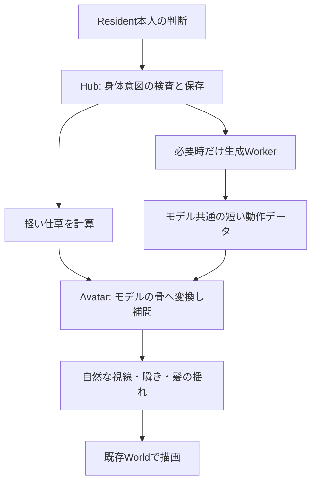

# Resident身体動作の実装案

> 状態: 承認前の実装案。製品へ実装済みという意味ではない。  
> 作成日: 2026-10-02  
> 参照: [調査メモ](resident-motion-generation-research-notes.md)、現行基本設計§13・§16・§20、実Hub / Avatar / Conversationコード。

## 1. 到達させる動作

Resident本人が、会話・Persona・状況を材料に「穏やかに右手を振る」「うなずく」「少し身体を傾ける」等を決め、Niraiが滑らかな身体運動へ変換する。骨の角度を毎フレームLLMへ問い合わせない。文章の感情をプログラムが推測して勝手に身振りを選ぶ対応表も作らない。

軽い動作は既存のThree.js / three-vrmで計算する。自由な数秒の複雑動作は、実機検証を通過した生成モデルを必要時だけ起動する。手元のVRM 0.x / 1.0で同じ入口を使う。開始・切替・終了は滑らかにつなぐ。

通常のSay / Whisperでも、会話本文とは別に本人の身体意図を受け取る。Task会話では既存のAvatar Capabilityから同じ身体意図を渡す。通常会話を裏でTaskに変換しない。

## 2. 今のNiraiに合わせる構成

- **既存のAvatarへ統合する。** 別のAvatar Loader、表情制御、描画ループを導入しない。fano-vrm-controllerの丸ごと依存採用は見送る。現在のLoader、外見Metadata、視線の制限、Hubへの表示報告を維持する。
- **身体意図は意味で指定する。** 軽い動作では対象・左右・強さ・速度・長さを渡す。複雑動作では短い動作説明と長さを渡す。Residentへモデル固有の骨名、ファイルパス、実行コマンドを公開しない。後者の詳しい生成入力は実機検証後に確定する。
- **現行30fpsで補間する。** 動作を生成する頻度と描画周期を分ける。GPUを節約するため、現段階では60fpsへ一律変更しない。
- **一つの順序で姿勢を組み立てる。** モデル別の基準姿勢 → 意図的な身体動作 → その姿勢に自然な視線を加える → `vrm.update`。現在のgazeが頭・首を初期姿勢へ上書きする点を整理する。各フレームの回転を前フレームへ積み増ししない。
- **骨の向きを実モデルから求める。** 直前の腕姿勢修正を維持する。左右の腕の向きやVRMの版を固定回転で決めない。顔・眼球・衣装・髪の骨を身体動作で上書きしない。

## 3. 会話・保存・停止の契約変更

現在の通常Conversationは本文だけを返し、Task / Run / Tool権限を与えない。ここを単に汎用Tool許可へ変更すると範囲が広がりすぎるため、**その返答を生成中のResident本人にだけ有効な、身体表現専用の権限**を追加する。

- できることは本人の利用可能な身体動作の確認と、有限の身体意図の提出だけ。生成中の返答ID・本人・期限へ結び付け、生成終了・Timeout・再起動で権限を閉じる。HoloはTask用の汎用Capability呼出と別の認証入口を使う。File、Shell、Task操作、他Resident操作は許可しない。
- Provider上の人間向け本文を変更・再生成せず、そのまま保存する。身体意図を本文から抜き出す目印方式は使わない。
- Codexでは専用の身体Toolを、HoloではNirai-MCPの身体専用入口を接続する。Holo通常会話への接続情報追加は、現行§13・§20の変更として扱う。既存TaskのTurn権限と混同しない。
- 通常会話の身体意図は既存の返答記録に結び付ける。Taskの身体意図は既存のRun結果へ結び付ける。別の永続Motion Queueを増設しない。Task用の外見保存と有限動作の消費記録は混ぜない。
- 身体意図は要求ID、Resident ID、モデル指紋、現在の読込token、期限に結び付ける。再読み込み・モデル差替え・Hub再起動後は、前の読込token向けの身振りを再生しない。
- Hubは要求ごとの開始を一度だけ受け付け、消費済みという観測を元のRunまたは返答記録に結び付けて同じ保存処理で確定する。正常終了済みRunの意図を後から書き換えない。開始受付後・初描画前に落ちた場合は表示成功とせず、自動再送もしない。開始受付と実描画の確認は別に報告する。
- 生成失敗や期限切れでは基準姿勢へ戻す。身体動作の失敗を会話本文の失敗として扱わない。未実行の生成を成功扱いしない。
- Pause / CancelではそのTaskに由来する動作を停止する。Taskの正常完了では新規受付を閉じ、完了前にHubが開始を受け付けた有限動作だけを期限まで許す。開始受付前にTaskが終了した要求は破棄する。
- Worldの「動きを止める」、動きを抑える設定、非表示、描画喪失では有限動作を中止する。復帰時は基準姿勢へつなぎ、身体機能の待機動作へ戻る。同じ要求を最初から再実行しない。

これは追加契約の提案であり、現在の基本設計へまだ書き込んでいない。

## 4. 複雑な動作の生成モデル

優先検証候補は **NVIDIA Kimodo-SOMA-RP-v1.1**。正式採用はこのPCでの生成とVRM表示が成立してから決める。

公式READMEには、文章処理をCPUへ置いた場合、GPU使用量は3GB未満とある。ただし確認済みGPUにRTX 2080 Superの世代は列挙されておらず、このPCで動く・速いという保証には使わない。現機はRTX 2080 Super 8GB、メインメモリ32GB。CPU側の8B text encoderはBF16の重みだけで約16GBを使う計算で、読み込みの一時領域やNirai / Serinaの分も別途必要になる。

| 必要物 | 公式一覧からの概算 |
|---|---:|
| Kimodo-SOMA-RP-v1.1 | 1.13GB |
| Llama 3 8B Instructの重み | 約16.07GB |
| LLM2Vec追加重み2種類 | 約0.35GB |
| モデル合計 | 約17.55GB |
| Python / PyTorch等の追加依存 | 暫定3〜6GB。導入前に確定する |

導入を承認する場合の提案上限は、**総ダウンロード25GB、作業空き容量50GB**。既存キャッシュを確認して必要ファイルだけを取得し、上限を超える場合は止める。Llamaの取得に必要な利用条件への同意とアカウント上のアクセス許可はMasterが行う。課金サービスは含めない。

実装時は文章処理を明示的に`local`へ設定し、生成時の外部APIへの自動切替を禁止する。必要ファイルが欠けた場合の自動ダウンロードも禁止する。モデルの事前検査とoffline設定を併用する。

最小の隔離Python環境を作り、生成WorkerをResident間で共有する。同時推論は一つに制限し、生成結果と文章の埋め込みを容量制限付きで再利用する。再生中の推論は不要。使用後はWorker終了によるGPU・メモリ解放を実測する。SerinaのProcessをNiraiが勝手に終了・退避させない。

Kimodoの出力は骨名・階層・基準姿勢・単位を添えて受け取る。SOMAの出力を30関節という固定番号でVRMへ渡さない。公式の現在のNPZ / BVH出力は77関節で、NPZはm、BVHはcm。生成元の身体比率や骨軸をVRM側へそのままコピーしない。

MotionLCMは公式LICENSEが非商用研究向けなので標準経路にしない。HY-Motion Liteも公式の必要GPUメモリが今回のPCを上回る。MoMaskはKimodoが実機で不適合だった場合の再調査候補で、コードの許可だけを根拠に重みや元データの条件が確認済みとは扱わない。

## 5. 実装順と完了判定

### 第1段階: 軽い身体動作と共通再生基盤

モデルのダウンロードなしで実装する。対象は、強さ・速さ・左右・時間を変えられる手振り、うなずき、首傾げ、身体の傾き、腕を使う説明の仕草。呼吸等の身体機能は自動で動かせるが、意味のある仕草はResident本人が選ぶ。

主な変更先は`src/shared/body.ts`、`src/hub/avatar.ts`、Conversation / Provider / MCPの身体専用接続、必要最小限のStore保存、`src/renderer/world/body.js`、`avatar.js`、`gaze.js`、`index.js`、表示報告のIPC、関連テストと現行文書。通常会話まで接続するため、Rendererだけの小修正では完結しない。

完了条件:

1. Taskと通常会話で、本人が選んだ意図だけが本人のAvatarへ反映される。一般のPC操作権限が増えない。
2. Akyo・Mirdo・Yumekaで同じ意図を再生し、開始・中間・終了の実骨位置と画像を確認する。終わると腕を下げた姿勢へ滑らかに戻る。
3. 瞬き、本人の表情・衣装、制限付き視線、髪の揺れ、Focusと既存のWorld停止を維持する。
4. 古い要求、別モデル、期限切れ、途中取消、再読み込み、Hub再起動、描画復旧で動作を重複再生しない。
5. 恒久テストと影響範囲のsmokeを通す。実Codex / Holoの通常会話で本人による身体意図の提出と表示を確認する。模擬Providerの成功だけを実接続成立と呼ばない。

### 第2段階: 生成AIの実機検証と接続

ダウンロード承認とLlamaへのアクセス確認後に着手する。「手を振る」「歩く」「泳ぐ」を各1本実際に生成し、Akyo・Mirdo・Yumekaへ変換して表示する。生成元の骨の仕様が判明してから自由動作の詳しい入力を確定する。

測定するのは冷起動時間、生成時間、最大GPU使用量、最大CPUメモリ、Worker終了後の解放、Serinaと同時使用した場合の余裕。泳ぎは生成品質を独立に判定する。生成AIが不適合の場合、軽い動作を生成AIによる自由動作の実装済みと置き換えて報告しない。

### 第3段階: World内の実移動

歩く・泳ぐ身体運動の生成と、海中での前進・浮力・他Residentとの距離は別の実装になる。まず生成clipをその場で再生して身体変換を確認し、次にWorld側で移動を制御する。生成root motionを直接Avatarへ適用しない。

移動を追加する際は、Avatar自身の水面・海底・水平範囲、相手へ近づく際の停止距離、再起動後の位置、Focus追従を現行Worldの契約へ統合する。現在のCamera制限をAvatarの移動制限として流用しない。この出口まで通って初めて「World内を実際に泳げる」とする。

## 6. 今回の確認資料

- [Kimodo公式README](https://github.com/nv-tlabs/kimodo): CPU text encoderとGPU使用量。
- [Kimodoモデルカード](https://huggingface.co/nvidia/Kimodo-SOMA-RP-v1.1): 対応GPU、SOMA版の利用条件。
- [Kimodoファイル一覧](https://huggingface.co/nvidia/Kimodo-SOMA-RP-v1.1/tree/main)、[Llamaファイル一覧](https://huggingface.co/meta-llama/Meta-Llama-3-8B-Instruct/tree/main)、[LLM2Vec MNTP](https://huggingface.co/McGill-NLP/LLM2Vec-Meta-Llama-3-8B-Instruct-mntp/tree/main)、[supervised](https://huggingface.co/McGill-NLP/LLM2Vec-Meta-Llama-3-8B-Instruct-mntp-supervised/tree/main): 上記容量見積もり。正確なbyte単位ではなく一覧の丸め表示。
- [公式installation](https://research.nvidia.com/labs/sil/projects/kimodo/docs/getting_started/installation.html)、[依存定義](https://github.com/nv-tlabs/kimodo/blob/main/pyproject.toml): 導入対象。
- [公式loader](https://github.com/nv-tlabs/kimodo/blob/main/kimodo/model/load_model.py): text encoderのdevice / dtype、API自動切替とdownload fallback。
- [公式出力形式](https://research.nvidia.com/labs/sil/projects/kimodo/docs/user_guide/output_formats.html): 関節数・単位・基準姿勢。
- [NVIDIA Open Model License](https://www.nvidia.com/en-us/agreements/enterprise-software/nvidia-open-model-license/): 重みの条件。Llama側の条件は別途適用。
- [MotionLCM LICENSE](https://github.com/Dai-Wenxun/MotionLCM/blob/main/LICENSE)、[HY-Motion](https://github.com/Tencent-Hunyuan/HY-Motion-1.0)、[MoMask](https://github.com/EricGuo5513/momask-codes): 代替候補の判断根拠。

## 7. 承認対象

推奨は、まず第1段階の大規模改修を承認し、動作と通常会話への接続を確認する進め方。生成モデルをまだ導入しなくても、生成元を差し替えられる共通再生基盤をここで作る。第2段階のダウンロードは別に承認する。

第1段階だけの承認には、生成モデルの導入とWorld内の実移動を含めない。

一括で進める場合は、第1段階に加え、上限25GBの取得・隔離環境への依存導入・Kimodoの実機検証と接続、検証成功後の第3段階のWorld内移動までを承認対象とする。生成結果を実機で評価してから次の段階へ進む。どちらの場合も、メモの全機能や自由な泳ぎが成立したと先に扱わず、各完了条件を通してから製品へ反映する。
